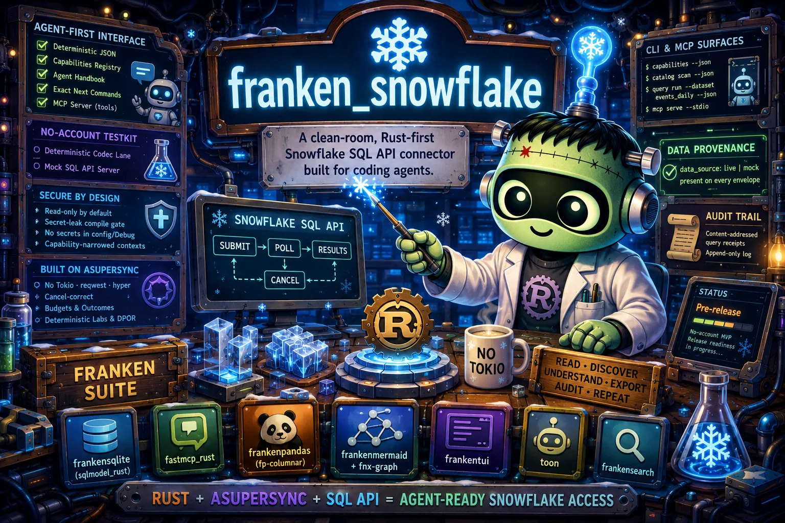

<div align="center">

# franken_snowflake



**A clean-room, Rust-first Snowflake SQL API connector built for coding agents.**


</div>

> **A working, clean-room Snowflake SQL API connector for Rust and coding agents.**
> It authenticates to live Snowflake accounts (key-pair JWT, PAT, or OAuth
> bearer), submits SQL over the [SQL API](https://docs.snowflake.com/en/developer-guide/sql-api/index)
> with no ODBC, no JDBC, and no Tokio, and streams back typed results, catalog
> discovery, and lineage as deterministic JSON or `toon`. It ships an
> agent-ergonomic CLI (`franken-snowflake` / `fsnow`), an optional MCP server, a
> TUI, and a full deterministic testkit. Live transport is built in and turned on
> with the `live` feature; the default build is a credential-free slice that
> exercises the same contracts offline for fast, deterministic agent work and CI.

---

## TL;DR

### The Problem

Snowflake ships official drivers for Go, JDBC, .NET, Node.js, ODBC, PHP, and
Python. It does not ship one for Rust. A Rust service, or a coding agent that
wants to query Snowflake without standing up a Python sidecar, is left with ODBC
bridges, JDBC over JNI, or third-party crates whose dependency graphs pull in
Tokio, `reqwest`, and a transitive forest no one audited.

For an agent the situation is worse. Raw SQL plus scattered secrets is a poor
interface. There is no machine-readable capability list, no way to ask "what
data exists here," no deterministic JSON contract, and no guardrail against
running an expensive unbounded scan by accident.

### The Solution

`franken_snowflake` talks to the [Snowflake SQL API](https://docs.snowflake.com/en/developer-guide/sql-api/index)
directly over HTTPS, with no ODBC, no JDBC, and no third-party Snowflake crate.
It is built on [Asupersync](https://github.com/Dicklesworthstone/asupersync), a
spec-first, cancel-correct, capability-secure async runtime, so networking,
cancellation, retry budgets, and deterministic tests come from one audited
foundation instead of the Tokio ecosystem.

The interface is designed for agents first: a deterministic versioned JSON
envelope on every read command, a self-describing capability registry, a
binary-embedded handbook, exact next-command suggestions inside errors, stable
exit codes, and an optional [MCP](https://modelcontextprotocol.io) server that
turns every read verb into a callable tool. A no-account testkit proves the
protocol before any live credential exists.

### Why franken_snowflake?

| Capability | What you get |
|---|---|
| Rust-first, memory-safe | `forbid(unsafe_code)` workspace-wide; lints `deny` `unwrap`/`expect`/`panic`/`todo`/`dbg!` |
| No hidden async runtime | Built on Asupersync; production crates forbid Tokio, reqwest, hyper, axum, tower, sqlx, diesel, sea-orm |
| Agent-ergonomic by default | Deterministic `--json` (and token-efficient `--toon`), `capabilities`, `agent-handbook`, `onboard`, `did_you_mean`, stable exit codes |
| Callable as a tool | Optional `mcp serve` exposing the same handlers and envelope contract over stdio or HTTP |
| Provable without credentials | No-account testkit: deterministic codec lane under a lab runtime plus a mock SQL API server |
| Never a fixture posing as live data | `data_source` provenance on every envelope; the live path refuses cleanly when credentials are absent |
| Read-only by default | Capability-narrowed contexts; mutation is gated behind an explicit write-intent ladder |
| Secrets stay secret | No secret in config, `Debug`, JSON, or panic text; a compile-time leak gate enforces it |
| Auditable after the fact | Content-addressed query receipts and an append-only audit log |

---

## Quick Example

Everything below runs without a Snowflake account. Read commands emit a
deterministic JSON envelope on stdout (`--json`, the default) or a
token-efficient `--toon` encoding. Diagnostics go to stderr. An empty-but-valid
result is exit 0 with an empty payload, never a non-zero exit.

```bash
# One call that orients an agent: capabilities, exit codes, first commands, health.
fsnow onboard --json

# The complete machine-readable command registry.
fsnow capabilities --json

# Local, non-live readiness checks.
fsnow doctor --json

# Validate a profile's shape and the env-var handles it references (no network).
fsnow profile validate demo-prod --json

# Ask the connector to describe a filter operator as JSON Schema 2020-12.
fsnow dataset describe-operator between --jsonschema

# Validate and explain a read-only SQL plan without submitting it.
fsnow query plan --profile demo-prod --sql "select * from events limit 10" --json

# Render catalog lineage as Mermaid (live source requires the `live` feature + credentials).
fsnow catalog graph demo-prod --database ANALYTICS --schema PUBLIC --mermaid
```

`fsnow` is the short alias for the canonical `franken-snowflake` binary. Both
share one entry point and one contract, so every example works under either
name.

---

## Design Philosophy

**Clean-room and Rust-first.** No ODBC, no JDBC bridge, no vendored or
third-party Snowflake crate. The connector speaks the documented SQL API over
HTTPS. Third-party Rust Snowflake crates may be studied as read-only
inspiration, but they are never copied or added as production dependencies. The
authoritative behavioral sources are Snowflake's documentation, live protocol
observations, and the project's own conformance fixtures.

**Asupersync-native.** Each hard part of the connector maps to a concrete
Asupersync primitive: a four-valued `Outcome` (`Ok` / `Err` / `Cancelled` /
`Panicked`), a structured `CancelReason`, a `Budget` with a cost quota,
capability-row narrowing for read-only-by-default execution, `bracket` for
orphan-free statement cancellation, and a deterministic lab runtime with DPOR
race coverage for the cancellation and retry paths. The HTTP/TLS transport,
gzip, and retries also come from Asupersync, not Tokio.

**No-account first.** The protocol is provable before any credential exists.
Two lanes carry the proof: a deterministic codec lane over a virtual TCP
transport under the lab runtime, and an integration lane against a mock SQL API
server. Live tests are opt-in and emit a typed skip or refusal when credentials
are absent, rather than silently passing.

**Agent-ergonomic JSON contracts.** Every read command returns a versioned
envelope with a typed `outcome_kind`, a `data_source` provenance field, a stable
error code from a central registry that gives each code a default recovery path,
`did_you_mean` suggestions, and a documented exit-code scheme where an
empty-but-valid result is exit 0. The CLI and the MCP server share the exact
same handlers, so the two surfaces cannot drift into two contracts.

**Forbid-unsafe and deny-panic.** The workspace sets `unsafe_code = "forbid"`
and denies `clippy::unwrap_used`, `expect_used`, `panic`, `todo`, and
`dbg_macro`. Every crate inherits the policy through `[lints] workspace = true`,
and the policy is verified to actually fail a build or clippy run.

**Redaction, guardrails, and budgets.** Secrets never appear in config,
`Debug`, JSON output, or panic text; a compile-time gate fails the build if a
credential-shaped field derives `Debug`. Read-only is the default, narrowed to
the capabilities a path actually needs. Cost and safety guardrails bound work
before it is dispatched, and result rows are capped into a response envelope
with an explicit `truncated` flag so an agent never receives an unbounded
payload by surprise.

**Deterministic testkit.** A shared golden framework, a JSON-line logger, a
deterministic clock, and a canary guard back the proof lanes. Goldens are
newline-pinned and CRLF-safe so they compare identically across platforms.

---

## How It Compares

`franken_snowflake` runs real queries against live Snowflake accounts and also
ships a full credential-free slice for offline contract work and deterministic
CI. The table below sets it against the alternatives.

| | franken_snowflake | Official drivers (Python / Go / JDBC / ...) | Third-party Rust crates | ODBC / JDBC bridge |
|---|---|---|---|---|
| Language / runtime | Rust on Asupersync | Per language | Rust on Tokio | Native lib plus bridge |
| Hidden Tokio/reqwest graph | None, by policy | n/a | Usually | n/a |
| Agent JSON contract plus MCP | First-class | No | No | No |
| No-account deterministic tests | Yes | Varies | Rare | No |
| Read-only-by-default capability security | Compile-time | No | No | No |
| Secret-leak compile gate | Yes | No | No | No |
| Live queries against a Snowflake account | Yes (`--features live`) | Yes | Varies | Yes |

If you are not working in Rust, an official driver is the natural choice.
`franken_snowflake` exists for the Rust-first, agent-first, Tokio-free niche the
official drivers do not cover.

---

## Installation

Install with the one-liner below, or build from source. Until a tagged release
ships prebuilt binaries, the installer compiles the CLI from source for you, so a
Rust toolchain is required.

### curl (Linux and macOS)

```bash
curl -fsSL https://raw.githubusercontent.com/Dicklesworthstone/franken_snowflake/main/install.sh | bash
```

### PowerShell (Windows)

```powershell
irm https://raw.githubusercontent.com/Dicklesworthstone/franken_snowflake/main/install.ps1 | iex
```

The installer accepts these flags (pass after `bash -s --` for the curl form):

| Flag | Effect |
|---|---|
| `--version <v>` | Install a specific released version instead of the latest |
| `--dest <dir>` | Install into a chosen directory |
| `--system` | Install system-wide rather than per-user |
| `--easy-mode` | Guided, prompt-friendly install for newcomers |
| `--verify` | Verify checksums and signatures of the downloaded artifact |
| `--from-source` | Build from source instead of downloading a prebuilt binary |
| `--quiet` | Suppress non-error output |
| `--no-gum` | Plain output with no styled prompts |
| `--force` | Overwrite an existing install |

Until a release exists, the installer falls back to `--from-source`.

### From source

```bash
git clone https://github.com/Dicklesworthstone/franken_snowflake
cd franken_snowflake

# Default build: deterministic agent CLI with toon output, no live transport.
cargo build --release -p franken-snowflake-cli

# Or install the binaries (franken-snowflake and fsnow) onto your PATH.
cargo install --path crates/franken-snowflake-cli
```

The default build is a no-account slice: the `toon` output mode is on, while
`mcp` and `live` are off. Opt into them by feature:

```bash
# Add the MCP server surface.
cargo build --release -p franken-snowflake-cli --features mcp

# Add live Snowflake SQL API transport (credential-gated at runtime).
cargo build --release -p franken-snowflake-cli --features live

# Everything.
cargo build --release -p franken-snowflake-cli --features mcp,live
```

Both binary names install from the same crate: `franken-snowflake` is canonical
and `fsnow` is the short alias. The whole stack requires a nightly Rust
toolchain (edition 2024), inherited from the FrankenSQLite, sqlmodel, and
Asupersync dependency set; the pinned toolchain lives in `rust-toolchain.toml`.

---

## Quick Start

1. **Build the CLI.**

   ```bash
   cargo build --release -p franken-snowflake-cli
   ```

2. **Orient yourself in one call.**

   ```bash
   ./target/release/fsnow onboard --json
   ```

3. **Check local readiness (no network).**

   ```bash
   ./target/release/fsnow doctor --json
   ```

4. **Plan a read-only query offline.** The planner validates the statement,
   refuses mutations and multi-statement input, and returns a typed envelope
   without contacting Snowflake.

   ```bash
   ./target/release/fsnow query plan --profile demo-prod \
     --sql "select id, created_at from events limit 100" --json
   ```

5. **Run a live query.** Rebuild with the `live` feature, export the profile's
   credential env handles (see [Configuration](#configuration)), then run a real
   statement against your account.

   ```bash
   cargo build --release -p franken-snowflake-cli --features live
   ./target/release/fsnow query run --profile demo-prod \
     --sql "select current_version()" --json
   ```

---

## Command Reference

The canonical binary is `franken-snowflake`; `fsnow` is the identical alias.
Read commands default to `--json`. Pass `--toon` for the token-efficient
encoding (available when the default `toon` feature is compiled in). `--no-color`
is accepted and ignored. There is no `--version` flag; the compiled version and
feature set are reported inside the `capabilities` and `onboard` envelopes.

### Discovery and self-description

| Command | What it does |
|---|---|
| `fsnow onboard --json` | Mega-command: capabilities, exit codes, first commands, and health in one call |
| `fsnow capabilities --json` | The complete machine-readable command registry, including compiled `feature_flags` |
| `fsnow robot-docs guide` | An embedded agent guide for first-contact usage |
| `fsnow agent-handbook --json` | Envelope keys, exit codes, recovery commands, and non-goals |
| `fsnow doctor --json` | Local, non-live readiness checks |
| `fsnow selftest --json` | No-account protocol fixture readiness check |
| `fsnow help` / `fsnow --help` / `fsnow -h` | Top-level help envelope with `did_you_mean` on typos |

```bash
fsnow onboard --json
fsnow capabilities --toon
fsnow agent-handbook --json
```

### Profiles

| Command | What it does |
|---|---|
| `fsnow profile validate <profile> --json` | Validate the profile id and the env-var handle names it references, with no live I/O |
| `fsnow profile doctor <profile> --json` | Inspect profile readiness offline |
| `fsnow profile doctor <profile> --online --json` | Attempt a minimal live probe (`SELECT CURRENT_VERSION()`); requires the `live` feature and credentials |

```bash
fsnow profile validate demo-prod --json
fsnow profile doctor demo-prod --json
fsnow profile doctor demo-prod --online --json   # live feature + credentials
```

`profile validate` and `profile doctor` (without `--online`) never read a secret
value and never touch the network; they report the env prefix and the expected
handle sets per auth lane.

### Catalog discovery

| Command | What it does |
|---|---|
| `fsnow catalog scan <profile> --database <db> --schema <schema> --json` | Discover catalog metadata through `INFORMATION_SCHEMA.TABLES` |
| `fsnow catalog graph <profile> --database <db> [--schema <schema>] [--json\|--toon\|--mermaid\|--svg]` | Render catalog lineage (profile to database to schema to object) |

Both `--database` and `--schema` are required for `catalog scan`. `catalog
graph` requires `--database` and takes `--schema` optionally. Exactly one output
format may be chosen for `catalog graph`; mixing `--mermaid` with `--json` (or
two raw formats) is a usage error. Identifiers are validated as plain SQL
identifiers before interpolation, so a crafted value is rejected rather than
escaped-and-trusted. Live data requires the `live` feature plus credentials; the
no-account build returns a typed "live transport required" envelope.

```bash
fsnow catalog scan demo-prod --database ANALYTICS --schema PUBLIC --json
fsnow catalog graph demo-prod --database ANALYTICS --mermaid
fsnow catalog graph demo-prod --database ANALYTICS --schema PUBLIC --svg
```

### Datasets

| Command | What it does |
|---|---|
| `fsnow dataset inspect <dataset-id> --json` | Return a dataset manifest with its column and operator catalogs |
| `fsnow dataset profile <dataset-id> --json` | Plan pushed-down `APPROX_*` column profiling for a dataset |
| `fsnow dataset describe-operator <operator> --jsonschema` | Return JSON Schema 2020-12 for a supported filter operator |

`dataset describe-operator` is fully offline and deterministic. `dataset
inspect` and `dataset profile` return typed envelopes that describe the planned
shape while the dataset-manifest model is finalized.

```bash
fsnow dataset describe-operator between --jsonschema
fsnow dataset inspect events_daily --json
fsnow dataset profile events_daily --json
```

### Queries

| Command | What it does |
|---|---|
| `fsnow query plan --profile <profile> --sql <sql> --json` | Validate and explain a read-only plan without submitting it |
| `fsnow query run --profile <profile> --sql <sql> --json` | Submit a single read-only SQL API statement |
| `fsnow query --sql <sql> --profile <profile> --json` | Shorthand that maps to `query run` |
| `fsnow query cancel <statement-handle> --json` | Cancel a remote SQL API statement handle |

`query plan` runs offline: it validates the statement, refuses multiple
statements and non-read-only statements (UPDATE / DELETE / INSERT / MERGE / DDL),
and redacts secret-shaped SQL in its preview. `query run` applies the same
read-only safety check, then dispatches to the live transport when the `live`
feature is compiled and credentials are present; otherwise it refuses cleanly
with a typed envelope rather than substituting fixture or empty data. Live
results are capped into the envelope (with a `truncated` flag and a warning);
full extraction uses a Snowflake-side `LIMIT` or `COPY INTO`.

```bash
fsnow query plan --profile demo-prod --sql "select * from events limit 10" --json
fsnow query run  --profile demo-prod --sql "select current_version()" --json
fsnow query cancel 01b2c3d4-0000-abcd-0000-000000000001 --json
```

### Receipts and export

| Command | What it does |
|---|---|
| `fsnow receipt show <receipt-hash> --json` | Look up a content-addressed query receipt |
| `fsnow export plan --json` | Draft a `COPY INTO` or local CSV/JSONL export plan; execution is deferred |

```bash
fsnow export plan --json
fsnow receipt show 9f86d081884c7d659a2feaa0c55ad015a3bf4f1b2b0b822cd15d6c15b0f00a08 --json
```

### MCP and TUI

| Command | What it does |
|---|---|
| `fsnow mcp serve --stdio` | Serve the read verbs as MCP tools over stdio (requires the `mcp` feature) |
| `fsnow mcp serve --http <addr>` | Serve over HTTP at the given address |
| `fsnow tui --profile <profile>` | Launch the interactive TUI (requires the `tui` feature; opt-in and default-off) |

```bash
fsnow mcp serve --stdio
fsnow mcp serve --http 127.0.0.1:3000
fsnow tui --profile demo-prod
```

`--stdio` and `--http` are mutually exclusive. See the
[MCP surface](#mcp-surface) section for the tool roster.

### Note on shell completions

The CLI does not currently expose a `completions` subcommand. Agents and
installer scripts should discover commands and flags through `fsnow capabilities
--json` rather than a generated completion file.

---

## Configuration

A profile is a stable, lowercase-ish handle (1 to 128 ASCII letters, digits,
dot, dash, or underscore). Profiles carry no secrets. Instead, each profile maps
to a set of environment-variable handles, and the live transport reads those at
request time.

### Env-var naming

A profile name is uppercased and its dots, dashes, and underscores are
normalized to `_`, then prefixed with `FRANKEN_SNOWFLAKE_`. The profile
`demo-prod` therefore uses the prefix `FRANKEN_SNOWFLAKE_DEMO_PROD`.

| Handle | Purpose |
|---|---|
| `<PREFIX>_ACCOUNT` | Snowflake account locator or full `https://...snowflakecomputing.com` URL |
| `<PREFIX>_USER` | Snowflake user |
| `<PREFIX>_AUTH` | Auth lane: `pat`, `oauth_bearer`, or `key_pair_jwt` |
| `<PREFIX>_WAREHOUSE` | Warehouse for submitted statements |
| `<PREFIX>_DATABASE` | Optional default database (overridden by `--database`) |
| `<PREFIX>_SCHEMA` | Optional default schema (overridden by `--schema`) |
| `<PREFIX>_ROLE` | Optional role |
| `<PREFIX>_MAX_POLLS` | Optional poll budget (default 120) |

### Secret handles by auth lane

The secret value is referenced by env-var name and resolved at request time; it
is never stored in config and never read into a diagnostic message.

| Auth lane (`<PREFIX>_AUTH`) | Secret handle(s) |
|---|---|
| `pat` (programmatic access token) | `<PREFIX>_PAT` |
| `oauth_bearer` | `<PREFIX>_OAUTH_BEARER` |
| `key_pair_jwt` | `<PREFIX>_PRIVATE_KEY_PEM`, optional `<PREFIX>_PRIVATE_KEY_PASSPHRASE`, optional `<PREFIX>_JWT_VALIDITY_SECONDS` |

Auth lanes are implemented in this order: programmatic access token (PAT) for
fast administrator-managed onboarding, key-pair JWT for long-lived service users
and rotation, OAuth bearer where an OAuth flow already exists, and workload
identity federation only after the first three are stable.

### Example: a live PAT profile

```bash
export FRANKEN_SNOWFLAKE_DEMO_PROD_ACCOUNT="xy12345.us-east-1"
export FRANKEN_SNOWFLAKE_DEMO_PROD_USER="SVC_AGENT"
export FRANKEN_SNOWFLAKE_DEMO_PROD_AUTH="pat"
export FRANKEN_SNOWFLAKE_DEMO_PROD_WAREHOUSE="COMPUTE_WH"
export FRANKEN_SNOWFLAKE_DEMO_PROD_PAT="..."   # resolved at request time, never logged

# Confirm the handles are present (no network, no secret read):
fsnow profile validate demo-prod --json

# With a live build, probe connectivity without emitting any secret:
fsnow profile doctor demo-prod --online --json
```

### No-account vs live

The default build is a no-account slice with no transport linked. Discovery,
self-description, profile validation, offline `query plan`, and
`dataset describe-operator` all work with no credentials. The data-plane verbs
(`catalog scan`, `catalog graph` live source, `query run`,
`profile doctor --online`) require the `live` feature at build time and the
profile's credential handles at run time. When the feature is present but a
handle is missing, the command returns a typed credential error (exit 3); it
never silently returns empty or fixture data. On success, the envelope carries
`data_source = "live"` and the real statement handle.

---

## Architecture

```text
        agent or human
              |
              v
  franken-snowflake / fsnow CLI  ==  mcp serve  (shared handlers, one contract)
              |
   read-only agent surface (no account needed)
   onboard · capabilities · robot-docs · agent-handbook · doctor · selftest
   profile validate · profile doctor · dataset describe-operator
   query plan · catalog graph render · export plan draft
              |
              v
   franken-snowflake-core
   envelope · capabilities · outcome/exit · error registry · ids
   guardrails (cost/safety) · budget · cancel · redact · write_intent · adapter
              |
   ======================  no-account  |  live (feature = "live")  ======================
              |
              v
   auth  (PAT · key-pair JWT RS256 · OAuth bearer)   redaction policy + leak gate
   http  (Asupersync HTTP/1.1 + TLS + gzip, retries, Retry-After, submit-retry guard)
   sqlapi (submit · poll · partition stream · cancel · jsonv2 wire codec)
              |
              v
   catalog (info-schema discovery · model · operator · planner · predicate AST)
   graph (lineage · Mermaid/SVG) · frame (fp-columnar/fp-types) · export (COPY INTO + CSV/JSONL)
   cache (FrankenSQLite/sqlmodel metadata store) · text-indexing (frankensearch hash/lexical)
              |
              v
        Snowflake SQL API  (HTTPS)

   testkit  (parallel to all of the above, no account required)
   deterministic codec lane under the lab runtime · mock SQL API server
   replay · DPOR cancel/retry race suite · golden/clock/canary/logger harness
```

A submitted statement is modeled as an Asupersync `bracket`, so cancellation
always reaches Snowflake's remote cancel endpoint and no statement is orphaned.
The dataset planner compiles a named dataset plus entity and date-range hints
into pushed-down SQL with positional typed bindings; raw SQL mode is the expert
path. Both modes share one planner.

---

## MCP surface

With the `mcp` feature compiled in, `fsnow mcp serve` exposes the connector's
read verbs as MCP tools backed by the same CLI handlers and the same JSON
envelope, so the CLI and the MCP server cannot diverge into two contracts. The
server runs over stdio or HTTP and is read-only and stdio-first by design;
writes are deferred.

The exposed tools mirror the CLI verbs:

```text
capabilities          onboard               doctor
agent_handbook        robot_docs_guide      selftest
profile_validate      profile_doctor        catalog_scan
catalog_graph         dataset_inspect       dataset_profile
dataset_describe_operator                   query_plan
query_run             query_cancel          receipt_show
export_plan
```

```bash
# Build with MCP, then serve over stdio for a local agent.
cargo build --release -p franken-snowflake-cli --features mcp
fsnow mcp serve --stdio
```

---

## Troubleshooting

| Symptom | Likely cause | Fix |
|---|---|---|
| `Unknown flag` or `Unknown command` (exit 64) | Typo in a flag or verb | The envelope's `did_you_mean` lists the closest matches; run `fsnow capabilities --json` for the full registry |
| `query run` returns a "live transport required" envelope | The binary was built without the `live` feature | Rebuild with `--features live`, then export the profile's credential handles |
| Credential error (exit 3) on a live command | A required `<PREFIX>_*` handle is missing | Run `fsnow profile validate <profile> --json` to see the expected handle set, then export the missing ones |
| `--toon` rejected | The `toon` feature is not compiled in | Use `--json`, or rebuild with the default features (which include `toon`) |
| Safety refusal (exit 2) on `query run`/`query plan` | The SQL is a mutation, DDL, or multiple statements | Submit exactly one read-only statement (SELECT / WITH / SHOW / DESCRIBE / EXPLAIN) |
| `mcp serve` reports the feature is unavailable | The binary was built without the `mcp` feature | Rebuild with `--features mcp` |

Exit codes are stable and coarse: `0` success (including empty results), `1`
findings or warnings, `2` safety refusal, `3` credential or profile error, `4`
upstream Snowflake error, `5` network error or retry budget exhausted, `6` query
still running, `7` local cache error, `64` usage error, `74` I/O error. Each
error also carries a stable `FSNOW-<code>` string (for example `FSNOW-2003`
credential missing, `FSNOW-3001` mutation refused, `FSNOW-3002` multi-statement
refused) with an exact next command.

---

## Limitations

- **Live transport is a build feature.** It compiles behind the `live` feature,
  so the default build stays credential-free; build with `--features live` for
  real Snowflake access. Even then it is gated at runtime by credential
  availability and never substitutes fixture or empty data.
- **Distribution is from source for now.** There is no crates.io package or
  tagged binary release yet; install via the one-liner (which builds from source)
  or with `cargo install`. Prebuilt-binary releases arrive with the first tag.
- Read, query, catalog, and export come first. Write and update support is
  deliberately deferred behind a write-intent ladder; DDL stays disabled until
  there is a documented public use case.
- `query run` accepts exactly one read-only statement. Non-`SELECT` and
  multiple-statement requests are refused unless explicitly allowed.
- `dataset inspect` and `dataset profile` currently return typed "planned" or
  "requires model" envelopes while the dataset-manifest model is finalized.
- Local Arrow/Parquet export is deferred until a forbidden-dependency-clean
  writer is proven. Local export is CSV/JSONL; large export uses Snowflake-side
  `COPY INTO`.
- The TUI ships behind the `tui` feature (opt-in, default-off).
- The CLI has no `completions` subcommand; discover commands via `capabilities`.
- The whole stack requires a nightly Rust toolchain (edition 2024), inherited
  from the FrankenSQLite, sqlmodel, and Asupersync dependency set.

---

## FAQ

**Is this usable today?** Yes. Built with `--features live` and a profile's
credential handles, it runs real read-only queries against live Snowflake
accounts. The default credential-free build covers offline contract work,
deterministic fixtures, and CI.

**Why not just use an official driver?** Snowflake publishes none for Rust, and
the goal here is a Rust-first, Tokio-free, agent-ergonomic client, a niche the
official drivers do not cover. If you are not in Rust and need production today,
use an official driver.

**Why not a third-party Rust Snowflake crate?** Those may be studied as
read-only inspiration, but the policy forbids vendoring them or adding them as
production dependencies; the dependency graph and the clean-room posture matter
here.

**Why Asupersync instead of Tokio?** Cancellation correctness, capability
security, structured budgets, and deterministic lab and DPOR tests come from one
audited runtime. Production crates forbid Tokio, reqwest, hyper, axum, and tower.

**Does it need a Snowflake account to develop against?** No. The no-account
testkit (a deterministic codec lane plus a mock SQL API server) proves the
protocol before any live credential exists. Live tests are opt-in and refuse
clearly when credentials are absent.

**How do I turn on live Snowflake access?** Rebuild with `--features live`,
define the profile's `FRANKEN_SNOWFLAKE_<PROFILE>_*` env handles, and run a
read-only `query run`. Without the feature or the handles, the command refuses
cleanly instead of guessing.

**Can an agent call this as tools instead of shelling out?** Yes. Build with
`--features mcp` and run `fsnow mcp serve --stdio`. Every read verb becomes an
MCP tool with the same envelope contract as the CLI.

**Where are the issues tracked?** In [Beads](https://github.com/Dicklesworthstone/beads_rust)
(`br`), synced to JSONL in this repository, not GitHub issues. Use
`br ready --json` for actionable work and `br dep cycles` for graph health.

---

## About Contributions

Please don't take this the wrong way, but I do not accept outside contributions
for any of my projects. I simply don't have the mental bandwidth to review
anything, and it's my name on the thing, so I'm responsible for any problems it
causes; thus, the risk-reward is highly asymmetric from my perspective. I'd also
have to worry about other "stakeholders," which seems unwise for tools I mostly
make for myself for free. Feel free to submit issues, and even PRs if you want to
illustrate a proposed fix, but know I won't merge them directly. Instead, I'll
have Claude or Codex review submissions via `gh` and independently decide whether
and how to address them. Bug reports in particular are welcome. Sorry if this
offends, but I want to avoid wasted time and hurt feelings. I understand this
isn't in sync with the prevailing open-source ethos that seeks community
contributions, but it's the only way I can move at this velocity and keep my
sanity.

---

## License

MIT License (with OpenAI/Anthropic Rider). See [LICENSE](LICENSE).
</content>
</invoke>
