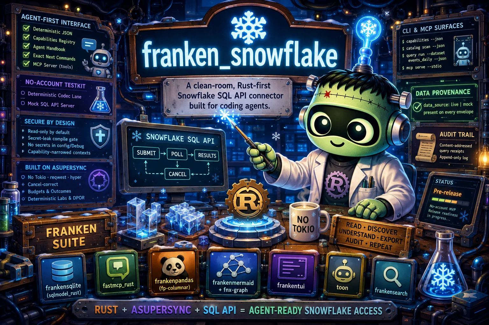

<div align="center">

# franken_snowflake



**A clean-room, Rust-first Snowflake SQL API connector built for coding agents.**


</div>

> **A clean-room Snowflake SQL API connector for Rust and coding agents.**
> It authenticates with a programmatic access token, a key-pair JWT, or an OAuth
> bearer token and submits SQL over the [SQL API](https://docs.snowflake.com/en/developer-guide/sql-api/index)
> with no ODBC, no JDBC, and no Tokio. Reads return typed rows (a DATE as
> `"2020-01-01"`, an exact decimal string for NUMBER(38,2), parsed JSON for a
> VARIANT; see [Result cells](#result-cells)), plus catalog discovery and
> a containment graph (database > schema > object > column); `query write` runs
> INSERT, MERGE, UPDATE, DELETE, and COPY INTO once a profile opts in. Results
> come back as deterministic JSON or `toon`. It ships an agent-ergonomic CLI
> (`franken-snowflake` / `fsnow`), an optional MCP server, a TUI, and
> deterministic tests that need no warehouse. The live SQL transport is compiled
> in with the `live` feature; it was last proven against a Snowflake trial
> account at the driver level (a PAT read, 2026-06-26), and an end-to-end live
> run of the CLI, including writes, is still pending.

---

## TL;DR

### The Problem

Snowflake ships official drivers for Go, JDBC, .NET, Node.js, ODBC, PHP, and
Python. It does not ship one for Rust. A Rust service, or a coding agent that
wants to query Snowflake without standing up a Python sidecar, is left with ODBC
bridges, JDBC over JNI, or third-party crates whose dependency graphs pull in
Tokio, `reqwest`, and a transitive forest no one audited.

For an agent the situation is worse. Raw SQL plus scattered secrets is a poor
interface. There is no machine-readable capability list, no way to ask "what
data exists here," no deterministic JSON contract, and no guardrail against
running an expensive unbounded scan by accident.

### The Solution

`franken_snowflake` talks to the [Snowflake SQL API](https://docs.snowflake.com/en/developer-guide/sql-api/index)
directly over HTTPS, with no ODBC, no JDBC, and no third-party Snowflake crate.
It is built on [Asupersync](https://github.com/Dicklesworthstone/asupersync), a
spec-first, cancel-correct, capability-secure async runtime, so networking,
cancellation, retry budgets, and deterministic tests come from one audited
foundation instead of the Tokio ecosystem.

The interface is designed for agents first: a deterministic versioned JSON
envelope on every command, a self-describing capability registry, a
binary-embedded handbook, exact next-command suggestions inside errors, stable
exit codes, and an optional [MCP](https://modelcontextprotocol.io) server that
turns every read verb into a callable tool. A deterministic testkit exercises
the protocol against a mock SQL API server, so the contracts are proven with no
warehouse before any live credential exists.

### Why franken_snowflake?

| Capability | What you get |
|---|---|
| Rust-first, memory-safe | `forbid(unsafe_code)` workspace-wide; lints `deny` `unwrap`/`expect`/`panic`/`todo`/`dbg!` |
| No hidden async runtime | Built on Asupersync; production crates forbid Tokio, reqwest, hyper, axum, tower, sqlx, diesel, sea-orm |
| Agent-ergonomic by default | Deterministic `--json` (or the alternate `--toon` encoding), `capabilities` with per-command JSON Schema inputs, `agent-handbook`, `onboard`, `did_you_mean`, stable exit codes |
| Callable as a tool | Optional `mcp serve` exposing the same handlers and envelope contract over stdio or HTTP |
| Deterministic tests | A mock SQL API server and a codec lane under a lab runtime exercise the contracts with no warehouse |
| Never a fixture posing as live data | `data_source` provenance on every envelope; the live path refuses cleanly when credentials are absent |
| Safe writes | `query write` runs DML and COPY INTO directly once a profile sets `WRITE_ENABLED`; `--dry-run` previews and binds a (profile, SQL) confirmation token, `WRITE_REQUIRE_CONFIRM` re-arms that ceremony, and DDL needs a separate opt-in |
| Secrets stay secret | No secret in config, `Debug`, JSON, or panic text; a compile-time leak gate enforces it |
| Auditable after the fact | Every live execution writes a BLAKE3 content-addressed receipt plus partition evidence and an append-only audit event to a local store; `receipt show <hash>` reads them back |

---

## Quick Example

The commands below cover discovery, self-description, and offline planning, and
they need no credentials. Read commands emit a deterministic JSON envelope on
stdout (`--json`, the default) or the alternate `--toon` encoding (same data,
round-trips exactly; byte size is comparable, token savings depend on your
tokenizer and payload shape).
Diagnostics go to stderr. An empty-but-valid result is exit 0 with an empty
payload, never a non-zero exit.

```bash
# One call that orients an agent: capabilities, exit codes, first commands, health.
fsnow onboard --json

# The complete machine-readable command registry.
fsnow capabilities --json

# Local readiness checks (no network).
fsnow doctor --json

# Validate a profile's shape and the env-var handles it references (no network).
fsnow profile validate demo-prod --json

# Ask the connector to describe a filter operator as JSON Schema 2020-12.
fsnow dataset describe-operator between --jsonschema

# Validate and explain a query plan without submitting it.
fsnow query plan --profile demo-prod --sql "select * from events limit 10" --json

# Render the catalog graph as Mermaid from the local snapshot (populated by
# `catalog scan`). A scope that was never scanned is never an empty graph: an
# offline build answers a typed error, and a `live` build scans it first.
fsnow catalog graph demo-prod --database ANALYTICS --schema PUBLIC --mermaid

# Dataset mode, planned offline against the local catalog snapshot: pushed-down
# SQL with typed bindings, a time range, an entity filter, and an enforced limit.
fsnow query plan --dataset analytics_public_events_b3_<hash> \
  --entity ENTITY123 --from 2024-01-01 --to 2024-12-31 --select EVENT_DATE,VALUE --json
```

With the `live` feature compiled in and the profile's credential handles
exported, the same binary reads from and writes to the live account:

```bash
# Read: run a single statement against the live account.
fsnow query run --profile demo-prod --sql "select current_version()" --json

# Write: once the profile sets WRITE_ENABLED, a bare `query write` executes the
# mutation directly and returns the live execution receipt.
fsnow query write --profile demo-prod --sql "insert into events (id) select 1" --json

# Optional preview: --dry-run executes nothing and returns the plan plus a
# confirmation token, without running the statement.
fsnow query write --profile demo-prod --sql "insert into events (id) select 1" --dry-run --json
```

`fsnow` is the short alias for the canonical `franken-snowflake` binary. Both
share one entry point and one contract, so every example works under either
name.

---

## Design Philosophy

**Clean-room and Rust-first.** No ODBC, no JDBC bridge, no vendored or
third-party Snowflake crate. The connector speaks the documented SQL API over
HTTPS. Third-party Rust Snowflake crates may be studied as read-only
inspiration, but they are never copied or added as production dependencies. The
authoritative behavioral sources are Snowflake's documentation, live protocol
observations, and the project's own conformance fixtures.

**Asupersync-native.** The connector runs on Asupersync, not Tokio: its
HTTP/TLS client and gzip carry the transport, and the statement driver returns
Asupersync's four-valued `Outcome` (`Ok` / `Err` / `Cancelled` / `Panicked`),
which reaches the CLI envelope intact (a cancellation reads `cancelled` or
`timeout`, never an internal error). Once a statement is submitted, every error
path and every deadline, budget, shutdown, or user cancellation fires a
best-effort remote cancel, and the
server-side `STATEMENT_TIMEOUT_IN_SECONDS` (60 s by default) is sent with every
request as the backstop. Each HTTP exchange is bounded (300 s), so a stalled
connection ends as a `timeout` with the remote cancel instead of hanging, and a
statement still running 5 s past its statement timeout is cancelled by the client
(outcome `timeout`, remote cancel sent). With `MAX_CREDITS` set, a statement whose
estimated credits reach the cap is cancelled the same way (cancel kind
`CostBudget`). The retry loop is the project's own, built on that
client. While a statement runs, Ctrl-C (SIGINT) or SIGTERM cancels it the same
way: the envelope reads `cancelled` and the exit status is 130 (SIGINT) or 143
(SIGTERM), as for any interrupted command; a second signal exits at once. The
receipt of a run that ended without rows names the statement handle, says
whether Snowflake ever accepted the statement (`accepted_by_snowflake`), and
records whether the remote cancel was acknowledged (`remote_cancel`). A
process killed with SIGKILL still leaves
it to the server timeout. A running statement is also held by a drop guard: if
the driver's future is dropped mid-flight (a library caller abandons it, a panic
unwinds through it), the remote cancel is still sent, from a thread and runtime
of its own, and the binary waits up to 10 s for it before exiting. Not yet wired:
capability-row narrowing. The testkit explores a model of the driver's
cancel and retry interleavings with DPOR.

**Deterministic tests.** The protocol is exercised without a warehouse. Two
lanes carry the proof: a deterministic codec lane over a virtual TCP transport
under the lab runtime, and an integration lane against a mock SQL API server.
Live tests are opt-in and emit a typed skip or refusal when credentials are
absent, rather than silently passing.

**Agent-ergonomic JSON contracts.** Every command returns a versioned envelope
with a typed `outcome_kind`, a `data_source` provenance field, a stable error
code from a central registry that gives each code a default recovery path,
`did_you_mean` suggestions, and a documented exit-code scheme where an
empty-but-valid result is exit 0. The CLI and the MCP server share the exact
same handlers, so the two surfaces cannot drift into two contracts.

**Forbid-unsafe and deny-panic.** The workspace sets `unsafe_code = "forbid"`
and denies `clippy::unwrap_used`, `expect_used`, `panic`, `todo`, and
`dbg_macro`. Every crate inherits the policy through `[lints] workspace = true`,
and the policy is verified to actually fail a build or clippy run.

**Safe writes, redaction, guardrails, and budgets.** Secrets never appear in
config, `Debug`, JSON output, or panic text: the auth crate's build fails if one
of its credential-shaped fields derives `Debug`, and a workspace test fails if
any crate's struct or enum would print one through `Debug` (derived, or a
manual impl that prints the field or never redacts). Reads run with read-only
capabilities, while writes are gated behind a per-profile `WRITE_ENABLED` opt-in
and execute directly once enabled; `--dry-run` previews and binds a confirmation
token to the exact statement, and `WRITE_REQUIRE_CONFIRM` makes that ceremony
mandatory for cautious profiles. Cost and safety
guardrails bound work before it is dispatched, and result rows are capped into a
response envelope with an explicit `truncated` flag so an agent never receives
an unbounded payload by surprise.

**Deterministic testkit.** A shared golden framework, a JSON-line logger, a
deterministic clock, and a canary guard back the proof lanes. Goldens are
newline-pinned and CRLF-safe so they compare identically across platforms.

---

## How It Compares

`franken_snowflake` implements the SQL API's read and write paths and ships
deterministic tests that exercise the same contracts offline for fast CI; live
proof so far is a driver-level read (see above). The table below sets it
against the alternatives.

| | franken_snowflake | Official drivers (Python / Go / JDBC / ...) | Third-party Rust crates | ODBC / JDBC bridge |
|---|---|---|---|---|
| Language / runtime | Rust on Asupersync | Per language | Rust on Tokio | Native lib plus bridge |
| Hidden Tokio/reqwest graph | None, by policy | n/a | Usually | n/a |
| Agent JSON contract plus MCP | First-class | No | No | No |
| Deterministic tests, no warehouse | Yes | Varies | Rare | No |
| Safe writes (`WRITE_ENABLED` gate, optional confirm) | Built-in | No | No | No |
| Secret-leak compile gate | Yes | No | No | No |
| Live read and write against a Snowflake account | Implemented (`--features live`); read proven at the driver level, CLI and writes pending | Yes | Varies | Yes |

If you are not working in Rust, an official driver is the natural choice.
`franken_snowflake` exists for the Rust-first, agent-first, Tokio-free niche the
official drivers do not cover.

---

## Installation

Install with the one-liner below, or build from source explicitly. The
installers download prepared GitHub release binaries by default; they do not
fall back to cargo builds when a release asset is missing.

### curl (Linux and macOS)

```bash
curl -fsSL https://raw.githubusercontent.com/Dicklesworthstone/franken_snowflake/main/install.sh | bash
```

### PowerShell (Windows)

```powershell
irm https://raw.githubusercontent.com/Dicklesworthstone/franken_snowflake/main/install.ps1 | iex
```

> `v0.0.5` ships Windows assets for both `x86_64-pc-windows-msvc` and
> `aarch64-pc-windows-msvc`; only the older `v0.0.2` release lacked them.

The installer accepts these flags (pass after `bash -s --` for the curl form):

| Flag | Effect |
|---|---|
| `--version <v>` | Install a specific released version instead of the latest |
| `--dest <dir>` | Install into a chosen directory |
| `--system` | Install system-wide rather than per-user |
| `--easy-mode` | Guided, prompt-friendly install for newcomers |
| `--verify` | Run a post-install self-test after checksum verification (no signatures are published) |
| `--from-source` | Developer-only: build from source instead of downloading a prepared release binary |
| `--live` | Source-build option: compile the `live` feature when combined with `--from-source` |
| `--quiet` | Suppress non-error output |
| `--no-gum` | Plain output with no styled prompts |
| `--force` | Overwrite an existing install |

The `v0.0.5` release binaries are built with `--features live,mcp`: they report
`feature_flags.live=true, mcp=true` in `capabilities`, so downloaded binaries
run live reads and writes out of the box. Credentials are always runtime-gated:
a live-capable binary refuses live operations cleanly (exit 3) when the
selected profile or environment does not provide credential handles, so the
offline surfaces still work with no credentials at all.

This README tracks `main`. Surfaces added after `v0.0.5` need a source build
until the next release.

To build the live-capable binary from source in one shot, pass both
`--from-source` and `--live` through the pipe:

```bash
curl -fsSL https://raw.githubusercontent.com/Dicklesworthstone/franken_snowflake/main/install.sh | bash -s -- --from-source --live
```

> `--from-source` builds from a fresh standalone clone: the FrankenSuite
> dependencies resolve from crates.io, so no local sibling checkout is required.

On Windows the `irm ... | iex` one-liner cannot forward arguments, so download
the script first and invoke it with the matching source-build switches:

```powershell
irm https://raw.githubusercontent.com/Dicklesworthstone/franken_snowflake/main/install.ps1 -OutFile install.ps1
./install.ps1 -FromSource -Live
```

### From source

```bash
git clone https://github.com/Dicklesworthstone/franken_snowflake
cd franken_snowflake

# Build the agent CLI with the default features (toon output on, live off).
cargo build --release -p franken-snowflake-cli

# Or install the binaries (franken-snowflake and fsnow) onto your PATH.
cargo install --path crates/franken-snowflake-cli
```

The default build compiles the deterministic agent surface with the `toon`
output mode on; the `mcp`, `live`, `frankenpandas`, and `frankensearch` features are off. Turn them on by feature:

```bash
# Add the MCP server surface.
cargo build --release -p franken-snowflake-cli --features mcp

# Add live Snowflake SQL API transport for reads and writes (credential-gated at runtime).
cargo build --release -p franken-snowflake-cli --features live

# Add FrankenPandas columnar frame materialization for result partitions.
cargo build --release -p franken-snowflake-cli --features frankenpandas

# Add Frankensearch hash and lexical text indexing.
cargo build --release -p franken-snowflake-cli --features frankensearch

# Everything.
cargo build --release -p franken-snowflake-cli --features mcp,live,frankenpandas,frankensearch
```

Both binary names install from the same crate: `franken-snowflake` is canonical
and `fsnow` is the short alias. The whole stack requires a nightly Rust
toolchain (edition 2024), inherited from the FrankenSQLite, sqlmodel, and
Asupersync dependency set; the pinned toolchain lives in `rust-toolchain.toml`.

---

## Quick Start

1. **Build the CLI.**

   ```bash
   cargo build --release -p franken-snowflake-cli
   ```

2. **Orient yourself in one call.**

   ```bash
   ./target/release/fsnow onboard --json
   ```

3. **Check local readiness (no network).**

   ```bash
   ./target/release/fsnow doctor --json
   ```

4. **Plan a query offline.** The planner validates the statement, refuses
   mutations and multi-statement input, and returns a typed envelope without
   contacting Snowflake.

   ```bash
   ./target/release/fsnow query plan --profile demo-prod \
     --sql "select id, created_at from events limit 100" --json
   ```

5. **Run a live read.** Rebuild with the `live` feature, export the profile's
   credential env handles (see [Configuration](#configuration)), then run a real
   statement against your account.

   ```bash
   cargo build --release -p franken-snowflake-cli --features live
   ./target/release/fsnow query run --profile demo-prod \
     --sql "select current_version()" --json
   ```

6. **Write data.** Enable writes for the profile, then run the mutation. Once
   `WRITE_ENABLED` is set, a bare `query write` executes the statement directly
   and returns the live execution receipt. `--dry-run` stays available as an
   optional preview.

   ```bash
   export FRANKEN_SNOWFLAKE_DEMO_PROD_WRITE_ENABLED=true

   # Execute the mutation directly and return the live receipt.
   ./target/release/fsnow query write --profile demo-prod \
     --sql "insert into events (id) select 1" --json

   # Optional: preview without executing (returns the plan plus a token).
   ./target/release/fsnow query write --profile demo-prod \
     --sql "insert into events (id) select 1" --dry-run --json
   ```

---

## Command Reference

The canonical binary is `franken-snowflake`; `fsnow` is the identical alias.
Read commands default to `--json`. Pass `--toon` for the alternate TOON
encoding (available when the default `toon` feature is compiled in); a payload
holding a control character TOON cannot escape (Snowflake names, comments and
cells are data and can carry terminal escapes) is printed as JSON instead, with
a note on stderr. No output mode writes a raw control character: JSON escapes
them, and `--mermaid`/`--svg` show them as visible symbols. The CLI never
colors its output, so `--no-color` is accepted and ignored. There is no `--version` flag; the compiled version and
feature set are reported inside the `capabilities` and `onboard` envelopes.

Every command that takes `--profile` (or a positional `<profile>`) also reads
`FRANKEN_SNOWFLAKE_DEFAULT_PROFILE`: set that variable once and `--profile`
becomes optional, while an explicit value still wins. See
[Configuration](#configuration).

### Discovery and self-description

| Command | What it does |
|---|---|
| `fsnow onboard --json` | Mega-command: capabilities, exit codes, first commands, and health in one call |
| `fsnow capabilities [--with-exe-hash] --json` | The complete machine-readable command registry, including compiled `feature_flags`, each command's `input_schema` (the exact flags it accepts), and `build` (version, `git_sha`, `dirty`, `source_digest` over the crate sources and Cargo.lock, target, profile, rustc, features; `--with-exe-hash` adds the SHA-256 of the running binary) |
| `fsnow robot-docs guide` | An embedded agent guide for first-contact usage |
| `fsnow agent-handbook --json` | Envelope keys, exit codes, recovery commands, and non-goals |
| `fsnow doctor --json` | Executed local readiness checks: binary/features, contract render+parse, data dir writable, local store opens, default-profile handle presence (names only) |
| `fsnow selftest --json` | Executed offline contract fixtures: envelope round trip, secret-redaction canaries, read-only guard cases, write ladder, operator schemas, local store round trip, export plan hardening |
| `fsnow help` / `fsnow --help` / `fsnow -h` | Top-level help envelope with `did_you_mean` on typos |

```bash
fsnow onboard --json
fsnow capabilities --toon
fsnow agent-handbook --json
```

### Profiles

| Command | What it does |
|---|---|
| `fsnow profile validate <profile> --json` | Validate the profile id and report which env-var handles are set, by name only (exit 1 lists the missing ones with exact `export` repair commands; exit 3 / `FSNOW-2002` when the live path would refuse the profile: an `_ACCOUNT` that does not form a canonical `https://<account>.snowflakecomputing.com` endpoint, or an unknown or quarantined auth lane) |
| `fsnow profile doctor <profile> --json` | Inspect profile readiness offline |
| `fsnow profile doctor <profile> --online --json` | Attempt a minimal live probe (`SELECT CURRENT_VERSION()`) and report the credential's remaining lifetime where knowable (a JWT OAuth bearer's `exp`; the PAT lane's active tokens from `SHOW USER PROGRAMMATIC ACCESS TOKENS`); requires the `live` feature and credentials |

```bash
fsnow profile validate demo-prod --json
fsnow profile doctor demo-prod --json
fsnow profile doctor demo-prod --online --json   # live feature + credentials
```

`profile validate` and `profile doctor` (without `--online`) never read a secret
value and never touch the network; they report the env prefix and the expected
handle sets per auth lane.

### Catalog discovery

| Command | What it does |
|---|---|
| `fsnow catalog scan <profile> --database <db> --schema <schema> [--max-view-refs <n>] [--tags] [--require-live] --json` | Discover tables, views, and columns through bound `INFORMATION_SCHEMA` statements, then the relation pass (primary keys, foreign keys, view dependencies, stages, file formats, external-table sources, and with `--tags` tag assignments); build dataset manifests (field roles, row/byte hints, primary keys) and persist the snapshot to the local store; `--require-live` hard-refuses with `FSNOW-3003` unless served by the live transport |
| `fsnow catalog graph <profile> --database <db> [--schema <schema>] [--refresh] [--json\|--toon\|--mermaid\|--svg]` | Render the catalog graph (containment: profile > database > schema > object > column; dataset-to-object and field-to-column edges; view dependencies, foreign keys, stage and file-format use, and tags from the relation pass) from the local snapshot, or from a live scan with `--refresh` |
| `fsnow catalog diff <profile> [--database <db>] [--schema <schema>] [--base <snapshot-id>] [--target <snapshot-id>] --json` | Compare two catalog snapshots or audit schema drift across historical scans from the local store; reports added/removed/modified tables and columns with breaking-change classification and envelope warnings |

Both `--database` and `--schema` are required for `catalog scan`. `catalog
graph` requires `--database` and takes `--schema` optionally. `catalog diff`
audits schema drift offline across stored snapshots. Exactly one output
format may be chosen for `catalog graph`; mixing `--mermaid` with `--json` (or
two raw formats) is a usage error. Scope values are passed to Snowflake as
positional bindings, never interpolated. `catalog scan` requires the `live`
feature plus credentials (the default build returns a typed "live transport
required" envelope); `catalog graph`, `catalog diff`, `dataset inspect`, and `dataset profile`
then work offline from the persisted snapshot.

The relation pass reads `SHOW PRIMARY KEYS IN SCHEMA` (quoted identifiers:
SHOW takes no binds), `INFORMATION_SCHEMA` `TABLE_CONSTRAINTS` +
`REFERENTIAL_CONSTRAINTS` (foreign keys, table level: Snowflake's documented
views do not map key columns, and a constraint name that does not identify
one table is reported, not guessed), `STAGES`, `FILE_FORMATS`,
`EXTERNAL_TABLES` (only when the schema has one), and
`GET_OBJECT_REFERENCES` once per view (the view's whole dependency closure;
`--max-view-refs`, default 25, max 500, 0 skips). `--tags` adds
`SNOWFLAKE.ACCOUNT_USAGE.TAG_REFERENCES`, which needs the `GOVERNANCE_VIEWER`
database role and lags up to two hours. A source Snowflake refuses
(privileges, edition, a view it cannot resolve) makes the scan
`partial_success` (exit 1) with a warning naming the source; the snapshot is
still persisted and records the gap, so a missing relation is never a silent
empty. Transport, auth, and cancel errors still fail the scan.

```bash
fsnow catalog scan demo-prod --database ANALYTICS --schema PUBLIC --json
fsnow catalog diff demo-prod --database ANALYTICS --schema PUBLIC --json
fsnow catalog graph demo-prod --database ANALYTICS --mermaid
fsnow catalog graph demo-prod --database ANALYTICS --schema PUBLIC --svg
```

### Datasets

| Command | What it does |
|---|---|
| `fsnow dataset inspect <dataset-id> --json` | Return the dataset manifest (roles, limits, row/byte hints), its column catalog (with column tags), its primary key and relations, and the operator catalog from the local store |
| `fsnow dataset profile <dataset-id> [--execute] --json` | Build the pushed-down `APPROX_COUNT_DISTINCT` / null-count / min-max profiling statement; `--execute` runs it live and returns the stats |
| `fsnow dataset validate-manifest --json` | Parse the dataset manifest overlay and check each entry's fields against the datasets in the local store |
| `fsnow dataset describe-operator <operator> --jsonschema` | Return the catalog entry and JSON Schema 2020-12 for one of the 11 filter operators (`eq neq lt lte gt gte between in is_null is_not_null contains`) |

`dataset describe-operator` is fully offline and deterministic. `dataset
inspect` and `dataset profile` read the snapshot a `catalog scan` persisted; an
unknown dataset is a typed `FSNOW-7002` error naming the scan command. Dataset
ids look like `<db>_<schema>_<object>_b3_<hash>` and are listed by `catalog scan`.

Discovery infers field roles from names and types. A non-secret TOML overlay
(`FRANKEN_SNOWFLAKE_MANIFEST`, or `<data dir>/datasets.toml`) confirms or
corrects them per dataset (by `id`, or `database` + `schema` + `object`):
field roles, `rights_class` (an unknown label fails closed to `restricted`),
`default_limit`, `max_rows_without_export`, and `description`. It applies at
read time to `dataset inspect`, `query plan|run --dataset`, and `dataset
profile`; overlaid fields report `role_confidence: overlay`. A field naming a
column the dataset lacks is a usage error with suggestions, a key that looks
like a credential is refused, and `dataset validate-manifest --json` checks the
file against the local store.

```toml
[[datasets]]
database = "ANALYTICS"
schema = "PUBLIC"
object = "EVENTS"
default_limit = 500

[[datasets.fields]]
column = "ACCOUNT_REF"
role = "entity_key"
```

```bash
fsnow dataset describe-operator between --jsonschema
fsnow dataset inspect events_daily --json
fsnow dataset profile events_daily --json
```

### Queries

| Command | What it does |
|---|---|
| `fsnow query plan --profile <profile> --sql <sql> --json` | Validate and explain a read plan without submitting it |
| `fsnow query plan --dataset <id> [--entity <v>] [--from <t>] [--to <t>] [--as-of <t>] [--select a,b] [--filter <json>] [--limit <n>] --json` | Dataset mode: compile pushed-down SQL with positional typed bindings, Time Travel `AT(TIMESTAMP => ...)` for `--as-of`, and an enforced limit, offline from the local snapshot |
| `fsnow query run --profile <profile> --sql <sql> [--limit <rows>] [--role <r>] [--warehouse <w>] [--statement-timeout <s>] [--require-live] [--raw-cells] [--allow-multiple-statements] --json` | Submit a single read statement (SELECT / WITH / SHOW / DESCRIBE / EXPLAIN); every flag is honored or rejected, never silently ignored. `--allow-multiple-statements` runs a batch of reads as one request (`MULTI_STATEMENT_COUNT` = the batch size) and answers each statement in order under `data.statements[]`; a mutation anywhere in the batch, bindings, or an empty statement is refused before any request. Rows are typed (`row_encoding: typed.v1`, see [Result cells](#result-cells)); `--raw-cells` returns the SQL API jsonv2 wire strings instead. Result partitions are fetched in a concurrent window and the fetch stops once `--limit` rows are assembled (`partitions_fetched` and a warning say so). `--require-live` hard-refuses with `FSNOW-3003` unless the envelope is backed by the live transport |
| `fsnow query run --dataset <id> ... --json` | Dataset mode: plan as above, then execute live with the same bindings |
| `fsnow query write --profile <profile> --sql <sql> [--dry-run \| --confirm <token>] --json` | Execute a mutation; direct once `WRITE_ENABLED` is set, with `--dry-run` as an optional preview (see [Writes](#writes)) |
| `fsnow query --sql <sql> --profile <profile> --json` | Shorthand that maps to `query run` |
| `fsnow query cancel <statement-handle> --profile <profile> --json` | POST to the SQL API cancel endpoint for a statement handle with the profile's credentials (live feature) |

### Result cells

`query run` (raw SQL and dataset mode), the MCP `query_run` tool and the
`query write` result carry `row_encoding: "typed.v1"`. Each column in
`data.columns` has its `type`, `precision`, `scale`, `nullable` and a
`json_repr` that holds for every cell of the column:

| Snowflake type | `json_repr` | Cell |
|---|---|---|
| NUMBER/FIXED, scale 0, precision up to 15 | `integer` | JSON number |
| other NUMBER/FIXED, DECFLOAT | `decimal_string` | exact decimal string (never a float) |
| FLOAT/REAL | `float` | JSON number; `"NaN"`, `"Infinity"`, `"-Infinity"` |
| BOOLEAN | `bool` | `true` / `false` |
| TEXT | `string` | string |
| BINARY | `hex` | hex string |
| DATE | `date` | `"2020-01-01"` |
| TIME | `time` | `"23:01:59.000000000"` |
| TIMESTAMP_NTZ | `timestamp_ntz` | `"2021-01-28T22:09:37.123456789"` (no offset) |
| TIMESTAMP_LTZ | `timestamp_utc` | `"2021-01-28T22:09:37.123456789Z"` |
| TIMESTAMP_TZ | `timestamp_offset` | `"2021-03-19T18:06:59.000000000+01:00"` |
| VARIANT, OBJECT, ARRAY | `json` | the parsed JSON value |
| anything else (GEOGRAPHY, ...) | `wire` | the SQL API string |

SQL NULL is `null`. A column with a cell that does not follow its type's wire
convention (or a VARIANT holding a number a JSON number cannot carry exactly,
such as an integer beyond 64 bits) keeps the wire strings for all of its cells,
`json_repr: "wire"`, and a warning names the column. `--raw-cells` returns
every cell as the SQL API sent it (`row_encoding: "jsonv2.wire"`). The
conventions follow the SQL API documentation; a live capture has not confirmed
them yet. Local CSV and JSONL exports write DATE, TIME and TIMESTAMP cells in
the same text forms; other cells keep their wire text (JSONL writes numbers and
booleans as JSON literals and VARIANT verbatim).

`query plan` runs offline: it validates the statement, refuses multiple
statements and mutating statements (UPDATE / DELETE / INSERT / MERGE / DDL), and
redacts secret-shaped SQL in its preview; to plan and execute a mutation, use
`query write`. `query run` is the read path: it accepts a single read statement,
applies the same safety check, then dispatches to the live transport when the
`live` feature is compiled and credentials are present; otherwise it refuses
cleanly with a typed envelope rather than substituting fixture or empty data. To
mutate data, use `query write`. Live read results are capped into the envelope
(with a `truncated` flag and a warning); full extraction uses a Snowflake-side
`LIMIT` or `COPY INTO`.

```bash
fsnow query plan --profile demo-prod --sql "select * from events limit 10" --json
fsnow query run  --profile demo-prod --sql "select current_version()" --json
fsnow query cancel 01b2c3d4-0000-abcd-0000-000000000001 --profile demo-prod --json
```

Every successful live execution stamps the envelope's `receipt_hash` with the
BLAKE3 content address of a query receipt written to the local store, together
with per-partition evidence and an append-only audit event; `receipt show
<hash>` reads it back. `budget_consumed.polls` and `duration_ms` are measured.

### Writes

`query write` executes INSERT, MERGE, UPDATE, DELETE, and COPY INTO against
the live account (the SQL API does not support `PUT`/`GET` file transfer, so
local files reach a stage through another client). Data writes are frictionless by default: once a profile sets
`WRITE_ENABLED`, a bare `query write` executes the statement and returns the live
execution receipt. `write` is a top-level alias for `query write`.

1. **Enable writes for the profile.** Data writes are off until you opt in per
   profile:

   ```bash
   export FRANKEN_SNOWFLAKE_DEMO_PROD_WRITE_ENABLED=true
   ```

2. **Run the mutation.** With the `live` feature and credentials present, the
   connector submits the statement directly and returns a `data_source = "live"`
   execution receipt with the statement handle and rows affected. No dry-run or
   confirmation token is required.

   ```bash
   fsnow query write --profile demo-prod \
     --sql "insert into events (id) select 1" --json
   ```

3. **Preview first (optional).** `--dry-run` plans the statement and executes
   nothing (exit 0). The envelope reports `statement_kind`, `safety_class`, and a
   `required_confirmation_token` such as `confirm:insert:<id>`. The id is random
   (it reveals nothing about the SQL) and the dry run is recorded in the local
   store, so `--confirm <token>` executes only that statement on that profile,
   within 15 minutes (`<PREFIX>_WRITE_TOKEN_TTL_SECONDS`), and only once: after
   the write completes the token is spent. A confirmed write submits the id as
   the SQL API `requestId` with `retry=true`, so replaying the same `--confirm`
   after a lost response returns the first result instead of writing twice. A
   supplied token is always checked, also in the default mode.

   ```bash
   fsnow query write --profile demo-prod \
     --sql "insert into events (id) select 1" --dry-run --json

   fsnow query write --profile demo-prod \
     --sql "insert into events (id) select 1" \
     --confirm confirm:insert:<id> --json
   ```

**Cautious mode (opt-in).** A profile can require the dry-run to confirm ceremony
on every write by setting `WRITE_REQUIRE_CONFIRM=true`. A bare `query write` then
refuses and tells you to `--dry-run` first, and execution requires the exact
`--confirm <token>`:

```bash
export FRANKEN_SNOWFLAKE_DEMO_PROD_WRITE_REQUIRE_CONFIRM=true
```

DDL (CREATE / ALTER / DROP / TRUNCATE / GRANT / REVOKE) needs a second opt-in on
top of `WRITE_ENABLED`; once set, DDL also executes directly (subject to
`WRITE_REQUIRE_CONFIRM` like everything else):

```bash
export FRANKEN_SNOWFLAKE_DEMO_PROD_WRITE_ALLOW_DDL=true
```

`CALL`, `EXECUTE IMMEDIATE` and `EXECUTE TASK` can run DDL and `GRANT` inside
the procedure, so they need `WRITE_ALLOW_PROCEDURES=true`; `COPY INTO` an
external URL (`'s3://...'`, `'gcs://...'`, `'azure://...'`) moves data outside
Snowflake and needs `WRITE_ALLOW_EXTERNAL=true` (unloads to `@stage` stay
ordinary writes). `WRITE_ALLOWED_KINDS=insert,merge,...` restricts a profile to
the listed statement kinds. Statements the SQL API cannot run as a single
statement (`PUT`, `GET`, `USE`, `ALTER SESSION`, `BEGIN`/`COMMIT`/`ROLLBACK`,
`SET`) are refused. A `COPY` with inline `CREDENTIALS` gets a warning to use a
storage integration instead (the key values are redacted in every output). Every write attempt is recorded on the append-only local
audit log (dry run, refusal, submission, result), and a write does not proceed
when the store cannot take the record.

Typed refusals keep the write path honest:

| Code | Meaning |
|---|---|
| `FSNOW-3007` | Writes are not enabled for the profile; set `<PREFIX>_WRITE_ENABLED=true` |
| `FSNOW-3008` | A confirmation token is missing (with `WRITE_REQUIRE_CONFIRM=true`) or does not match: no recorded dry run, another statement or profile, expired, or already used; run `--dry-run` again |
| `FSNOW-3009` | The statement is DDL and DDL is not opted in; set `<PREFIX>_WRITE_ALLOW_DDL=true` |
| `FSNOW-3010` | The SQL API cannot run this statement as a single statement (`PUT`/`GET`, `USE`, `ALTER SESSION`, transactions, `SET`) |
| `FSNOW-3011` | A procedure or external unload without its opt-in; set `<PREFIX>_WRITE_ALLOW_PROCEDURES` or `<PREFIX>_WRITE_ALLOW_EXTERNAL` |
| `FSNOW-3001` | The statement kind is not in the profile's `WRITE_ALLOWED_KINDS`, or the local audit log cannot be written |
| `FSNOW-2003` | A required credential handle is missing |

Without the `live` feature or without credentials, `query write` refuses cleanly
with a typed envelope (the write is authorized, but the execution rung reports
that live transport and credentials are required); it never fakes an execution.

### Receipts and export

| Command | What it does |
|---|---|
| `fsnow catalog relates <profile> <object> [--depth <n>] --json` | What relates to a catalog object (a node key, dataset id, or `DB.SCHEMA.OBJECT[.COLUMN]`, case-insensitive) within `--depth` hops, offline from the local snapshot; an unknown object is `FSNOW-7002` with suggestions |
| `fsnow catalog search <profile> "<words>" [--limit <n>] --json` | Rank the newest snapshot's datasets by the query's words in their names, columns, comments, and tags (whole words weigh twice a prefix; matching every word adds half), with where each word matched; offline, and nothing matching is an empty success |
| `fsnow catalog lineage <profile> <object> --up\|--down --json` | Dependency lineage, transitively: `--up` is what the object reads or references (view sources, referenced tables, stages, file formats), `--down` is what reads or references it (views, datasets, referencing tables); each node carries its depth and the edge kind that reached it. Containment is not lineage; a snapshot scanned before the relation pass says so in a warning |
| `fsnow catalog cycles <profile> --json` | Dependency cycles in the catalog graph |
| `fsnow receipt show <receipt-hash> --json` | Look up a content-addressed query receipt, its partition evidence, and the audit events that reference it |
| `fsnow receipt refetch <receipt-hash> [--profile <p>] [--limit <rows>] [--raw-cells] --json` | Re-read a completed statement's rows from Snowflake's result cache (`RESULT_SCAN` on the receipt's query id, kept about 24 hours) without running it again; an older receipt is refused (`FSNOW-7001`), an unknown one is `FSNOW-7002` (live feature) |
| `fsnow export plan --profile <p> --sql <select>\|--query-id <id> --location @stage/path [--format csv\|jsonl] [--compression gzip] [--header false] [--overwrite] [--single] [--max-file-size <bytes>] --json` | Build a content-addressed `COPY INTO <stage>` plan (Snowflake-side unload) and the exact `query write` command that executes it |
| `fsnow export run --profile <p> --sql <select>\|--query-id <id> --format csv\|jsonl\|parquet\|frame [--compression none\|snappy\|gzip] --out <path> [--overwrite] [--max-rows <n>] [--progress] --json` | Run a read live and write a content-addressed local CSV/JSONL/Parquet/frame artifact (live feature; frame requires `--features frankenpandas`). CSV and JSONL stream to the file partition by partition; a result over `--max-rows` (default 1000000) is refused with no file left. `--progress` (also on `query run`) writes one JSON object per statement event (`submitted`, `polled`, `partition_fetched` with rows and bytes, `completed`) to stderr; stdout stays the single envelope. An existing file is replaced only with `--overwrite` (atomically, via rename); a symlink or non-file target is refused. The envelope reports `resolved_path` and `overwrote` |

```bash
fsnow export plan --profile demo-prod --sql "select * from events" --location @my_stage/exports/run_001 --format jsonl --json
fsnow export run --profile demo-prod --sql "select * from events limit 1000" --format csv --out events.csv --json
fsnow receipt show 9f86d081884c7d659a2feaa0c55ad015a3bf4f1b2b0b822cd15d6c15b0f00a08 --json
```

Receipts, audit events, catalog snapshots, and dataset manifests live in an
append-only JSONL store under the platform data directory
(`~/.local/share/franken-snowflake`, `~/Library/Application Support/franken-snowflake`,
or `%APPDATA%\franken-snowflake`); `FRANKEN_SNOWFLAKE_DATA_DIR` overrides it.
`doctor` reports the resolved directory.

### MCP and TUI

| Command | What it does |
|---|---|
| `fsnow mcp serve --stdio` | Serve the read verbs as MCP tools over stdio (requires the `mcp` feature) |
| `fsnow mcp serve --http <addr> [--allow-origin <origin>]... [--allow-tool <tool>]... [--allow-remote]` | Serve over HTTP at `/mcp`; requires a bearer token in `FRANKEN_SNOWFLAKE_MCP_TOKEN` (at least 32 characters), checks `Host` and `Origin`, binds loopback only unless `--allow-remote`, and exposes only read-only tools unless `--allow-tool` names more |
| `fsnow tui --profile <profile>` | Interactive catalog browser + query planner (FrankenTUI) over the profile's latest local snapshot; needs a build with `--features tui` and a real terminal (a non-TTY invocation refuses typed instead of hanging). With `--features live`, submitting a planned query executes it through the same live path as `query run` on a background task: the UI stays live, the progress pane follows the statement (handle, partitions, rows), Esc on the progress pane cancels it (SQL API remote cancel included), and results land in the log pane; without `live`, submit logs a typed pointer to `query run` |

```bash
fsnow mcp serve --stdio
FRANKEN_SNOWFLAKE_MCP_TOKEN=<32+ char secret> fsnow mcp serve --http 127.0.0.1:3000
fsnow tui --profile demo-prod
```

`--stdio` and `--http` are mutually exclusive. See the
[MCP surface](#mcp-surface) section for the tool roster and the HTTP security
model.

### Note on shell completions

The CLI does not currently expose a `completions` subcommand. Agents and
installer scripts should discover commands and flags through `fsnow capabilities
--json` rather than a generated completion file.

---

## Configuration

A profile is a stable, lowercase-ish handle (1 to 128 ASCII letters, digits,
dot, dash, or underscore). Profiles carry no secrets. Instead, each profile maps
to a set of environment-variable handles, and the live transport reads those at
request time.

### Env-var naming

A profile name is uppercased and its dots, dashes, and underscores are
normalized to `_`, then prefixed with `FRANKEN_SNOWFLAKE_`. The profile
`demo-prod` therefore uses the prefix `FRANKEN_SNOWFLAKE_DEMO_PROD`.

| Handle | Purpose |
|---|---|
| `<PREFIX>_ACCOUNT` | Snowflake account locator or full `https://...snowflakecomputing.com` URL |
| `<PREFIX>_USER` | Snowflake user |
| `<PREFIX>_AUTH` | Auth lane: `pat`, `oauth_bearer`, or `key_pair_jwt` |
| `<PREFIX>_WAREHOUSE` | Warehouse for submitted statements |
| `<PREFIX>_DATABASE` | Optional default database (overridden by `--database`) |
| `<PREFIX>_SCHEMA` | Optional default schema (overridden by `--schema`) |
| `<PREFIX>_ROLE` | Optional role |
| `<PREFIX>_MAX_POLLS` | Optional poll budget (default 120) |
| `<PREFIX>_STATEMENT_TIMEOUT_SECONDS` | Optional SQL API statement timeout in seconds (default 60; `--statement-timeout` overrides per run). The client also cancels a statement still running 5 s past it (outcome `timeout`, remote cancel sent) |
| `<PREFIX>_MAX_CREDITS` | Optional advisory credit cap per request, e.g. `0.05`. A statement whose estimate reaches it is cancelled (outcome `cancelled`, cancel kind `CostBudget`, remote cancel sent), and a query is refused before it is submitted when resuming a suspended warehouse (billed 60 s at least) would already exceed it. The estimate is the warehouse's rate times execution time; Snowflake's bill (other queries, extra clusters) can differ, and the statement timeout stays the enforceable guard |
| `<PREFIX>_WAREHOUSE_CREDITS_PER_HOUR` | Optional warehouse rate for `MAX_CREDITS`. Without it the rate comes from `SHOW WAREHOUSES` (published Gen1 standard rates: X-Small 1 credit/hour, doubling per size); Gen2 and Snowpark-optimized warehouses have no published per-size rate, so they need this set |
| `<PREFIX>_PARTITION_CONCURRENCY` | Optional partition fetch window, 1-16 (default 4): how many result partitions are downloaded at once; assembly stays in order |
| `<PREFIX>_QUERY_TAG` | Optional. Unset: every live statement carries `QUERY_TAG = fsnow:<command_id>:<request_id>`, so Snowflake's query history ties back to the envelope and its receipt; a value fixes the tag for the profile; `off` sends none. `--query-tag` overrides it per run |
| `<PREFIX>_EXPORT_MAX_ROWS` | Optional row limit for `export run` (default 1000000; `--max-rows` overrides per run): a larger result is refused (`FSNOW-3004`) and leaves no file |
| `<PREFIX>_READ_ONLY_EXPECTED` | Set to `true` on a read profile to make `profile doctor --online` fail (`FSNOW-2002`, exit 3) when the role can write or its grants cannot be fully checked; without it a write-capable role on a read profile is a warning. Give each read profile a read-only role: Snowflake's RBAC is the enforceable guard, the client-side SQL check is a second line |
| `<PREFIX>_CA_BUNDLE` | Optional path to a PEM CA bundle, for a proxy that re-signs TLS traffic: the server certificate must chain to this bundle instead of the OS trust store. An unreadable bundle, or one without a certificate, is `FSNOW-2002`, never a fallback to the OS store. Connections on this path are not pooled |
| `<PREFIX>_WRITE_ENABLED` | Set to `true` to enable data writes (DML, COPY INTO) for the profile; a bare `query write` then executes directly |
| `<PREFIX>_WRITE_REQUIRE_CONFIRM` | Set to `true` to require the dry-run to confirm ceremony on every write (cautious opt-in); a bare `query write` refuses until you `--dry-run`, then `--confirm <token>` |
| `<PREFIX>_WRITE_ALLOW_DDL` | Set to `true` to additionally allow DDL (CREATE/ALTER/DROP/TRUNCATE/GRANT/REVOKE) through `query write` |
| `<PREFIX>_WRITE_ALLOW_PROCEDURES` | Set to `true` to allow `CALL`, `EXECUTE IMMEDIATE`, `EXECUTE TASK` (they can run DDL/GRANT inside) |
| `<PREFIX>_WRITE_ALLOW_EXTERNAL` | Set to `true` to allow `COPY INTO '<scheme>://...'` unloads outside Snowflake |
| `<PREFIX>_WRITE_ALLOWED_KINDS` | Optional comma-separated statement kinds this profile may write (`insert,merge,update,delete,copy_into_table,...`); an unknown kind is a profile error |
| `<PREFIX>_WRITE_TOKEN_TTL_SECONDS` | Lifetime of a dry-run confirmation token (default 900) |

### Global environment variables

These apply across profiles rather than to a single profile prefix.

| Variable | Purpose |
|---|---|
| `FRANKEN_SNOWFLAKE_DEFAULT_PROFILE` | Default profile used when `--profile` (or the positional `<profile>`) is omitted. Set it once to make `--profile` optional on every command; an explicit profile always wins. |
| `FRANKEN_SNOWFLAKE_DATA_DIR` | Override the local store directory (receipts, audit log, catalog snapshots, dataset manifests). |

```bash
# Make --profile optional for the rest of the session.
export FRANKEN_SNOWFLAKE_DEFAULT_PROFILE=demo-prod
fsnow query plan --sql "select 1" --json   # resolves to demo-prod
```

### Secret handles by auth lane

The secret value is referenced by env-var name and resolved at request time; it
is never stored in config and never read into a diagnostic message.

| Auth lane (`<PREFIX>_AUTH`) | Secret handle(s) |
|---|---|
| `pat` (programmatic access token) | `<PREFIX>_PAT` |
| `oauth_bearer` | `<PREFIX>_OAUTH_BEARER` |
| `key_pair_jwt` | `<PREFIX>_PRIVATE_KEY_PEM`, optional `<PREFIX>_PRIVATE_KEY_PASSPHRASE`, optional `<PREFIX>_JWT_VALIDITY_SECONDS` |

Auth lanes are implemented in this order: programmatic access token (PAT) for
fast administrator-managed onboarding, key-pair JWT for long-lived service users
and rotation, OAuth bearer where an OAuth flow already exists, and workload
identity federation only after the first three are stable. The
`workload_identity` lane is quarantined: its library code performs an OIDC token
exchange that is not Snowflake's documented `WIF.<provider>.<token>` bearer
scheme, so `profile validate` reports it as unusable (exit 3) and the live path
refuses it before any request.

The bearer is re-derived before every SQL API request, so a key-pair JWT that
approaches its validity window during a long poll is re-signed before the next
`GET` rather than failing. If the API still answers `401`, the JWT lane re-signs
exactly once and retries the same step; PAT and OAuth cannot re-sign, so a `401`
becomes a typed `credential_expired` error (with a remote cancel of the orphaned
statement when a handle exists). Account identifiers in JWT claims follow the
Snowflake rules: locator forms drop the region/cloud labels
(`xy12345.us-east-1.aws` becomes `XY12345`) while organization forms keep both
halves (`myorg.prod2` becomes `MYORG-PROD2`).

### Example: a live PAT profile with writes enabled

```bash
export FRANKEN_SNOWFLAKE_DEMO_PROD_ACCOUNT="xy12345.us-east-1"
export FRANKEN_SNOWFLAKE_DEMO_PROD_USER="SVC_AGENT"
export FRANKEN_SNOWFLAKE_DEMO_PROD_AUTH="pat"
export FRANKEN_SNOWFLAKE_DEMO_PROD_WAREHOUSE="COMPUTE_WH"
export FRANKEN_SNOWFLAKE_DEMO_PROD_PAT="..."   # resolved at request time, never logged

# Allow data writes (DML/COPY INTO); a bare `query write` then executes directly:
export FRANKEN_SNOWFLAKE_DEMO_PROD_WRITE_ENABLED=true

# Confirm the handles are present (no network, no secret read):
fsnow profile validate demo-prod --json

# With a live build, probe connectivity without emitting any secret:
fsnow profile doctor demo-prod --online --json
```

### Offline contracts and live data

The default build links no live transport. Discovery, self-description, profile
validation, offline `query plan`, `dataset describe-operator`, and `query write`
previews (`--dry-run`, once a profile sets `WRITE_ENABLED`) all work with no
credentials. The live data-plane verbs (`catalog scan`, `catalog graph` live
source, `query run`, `query write` execution, `profile doctor --online`) require
the `live` feature at build time and the profile's credential handles at run
time. When the feature is present but a handle is missing, the command returns a
typed credential error (exit 3); it never silently returns empty or fixture
data. On success, the envelope carries `data_source = "live"` and the real
statement handle.

---

## Architecture

```text
        agent or human
              |
              v
  franken-snowflake / fsnow CLI  ==  mcp serve  (shared handlers, one contract)
              |
   offline agent surface (no credentials needed)
   onboard · capabilities · robot-docs · agent-handbook · doctor · selftest
   profile validate · profile doctor · dataset describe-operator
   query plan (raw SQL or --dataset) · query write (dry-run) · export plan
   from the local store: catalog graph · dataset inspect · dataset profile · receipt show
              |
              v
   franken-snowflake-core
   envelope · capabilities · outcome/exit · error registry · ids
   guardrails (cost/safety) · budget · cancel · redact · write_intent · adapter
              |
              v
   live transport  (feature = "live", credential-gated at runtime)
   reads:  query run · catalog scan · profile doctor --online
   writes: query write --confirm  (INSERT/MERGE/UPDATE/DELETE/COPY INTO/DDL)
              |
              v
   auth  (PAT · key-pair JWT RS256 · OAuth bearer)   redaction policy + leak gate
   http  (Asupersync HTTP/1.1 + TLS + gzip, retries, Retry-After, submit-retry guard)
   sqlapi (submit · poll · partition stream · cancel · jsonv2 wire codec)
              |
              v
    catalog (info-schema discovery · manifests · operator catalog · dataset planner · predicate AST)
    graph (containment + dataset edges · Mermaid/SVG) · export (COPY INTO plans + local CSV/JSONL/Parquet/frame writers)
    cache (local store: append-only JSONL by default; FrankenSQLite backend opt-in)
    frame (fp-columnar/fp-types via --features frankenpandas) · text-indexing (frankensearch via --features frankensearch)
    interactive surface: tui (FrankenTUI via --features tui)
              |
              v
        Snowflake SQL API  (HTTPS)

   testkit  (parallel to all of the above; no warehouse required)
   deterministic codec lane under the lab runtime · mock SQL API server
   replay · DPOR model of the driver's cancel/retry races · golden/clock/canary/logger harness
```

Once a statement is submitted, the driver fires a best-effort remote cancel on
every error path, on a deadline, budget, shutdown, or user cancellation, and on
Ctrl-C (SIGINT) or SIGTERM; a process killed outright (SIGKILL) leaves the
statement to the server-side `STATEMENT_TIMEOUT_IN_SECONDS` sent with every
request. A `query write` runs in two rungs: a dry-run plans and emits a confirmation
token, and a confirm submits the authorized mutation through the same live
transport as a read. The dataset planner compiles a named dataset plus entity
and date-range hints into pushed-down SQL with positional typed bindings; raw
SQL mode is the expert path. Both modes share one planner.

---

## MCP surface

With the `mcp` feature compiled in, `fsnow mcp serve` exposes the connector's
read verbs, plus `query_cancel` and `export_run`, as MCP tools backed by the same
CLI handlers and the same JSON envelope, so the CLI and the MCP server cannot
diverge into two contracts. The server runs over stdio or HTTP and is
stdio-first by design; data writes go through the CLI `query write` ladder. A
`notifications/cancelled` for a running call, a stdio client closing its input,
or an HTTP client closing its connection mid-call cancels the statement it
started, SQL API remote cancel included.

The exposed tools mirror the CLI read and discovery verbs:

```text
capabilities          onboard               doctor
agent_handbook        robot_docs_guide      selftest
profile_validate      profile_doctor        catalog_scan
catalog_graph         catalog_diff          dataset_inspect
dataset_profile       query_plan            query_run
query_cancel          receipt_show          export_plan
export_run            dataset_describe_operator
```

`query_cancel` and `export_run` are not read-only (the first cancels a remote
statement, the second writes a local file), and their MCP annotations say so.
`export_run` from MCP is confined to the `exports/` directory under the data
directory: its `out` must be a relative path without `..` or symlinked
components, and an existing file is replaced only with `overwrite: true`.

Over HTTP the server listens on `/mcp` and refuses, before dispatch, any
request that lacks `Authorization: Bearer $FRANKEN_SNOWFLAKE_MCP_TOKEN` (401),
carries a `Host` other than the bound loopback name (403), or carries an
`Origin` not named by `--allow-origin` (403; CORS headers are sent only for
allowed origins). A web page open in the operator's browser therefore cannot
drive the server. Tools that are not read-only are hidden and refused over HTTP
unless `--allow-tool <name>` enables them, and a non-loopback bind requires
`--allow-remote`. The token is operator-supplied; the server never generates or
prints one. Each request leaves one JSON line on stderr (`method`, `path`,
`host`, `origin`, the JSON-RPC method and tool, `decision`, `status`), so a
refused cross-origin or unauthenticated attempt is on record; the authorization
header and tool arguments are never logged.

```bash
# Build with MCP, then serve over stdio for a local agent.
cargo build --release -p franken-snowflake-cli --features mcp
fsnow mcp serve --stdio
```

---

## Troubleshooting

| Symptom | Likely cause | Fix |
|---|---|---|
| `Unknown flag` or `Unknown command` (exit 64) | Typo in a flag or verb | The envelope's `did_you_mean` lists the closest matches; run `fsnow capabilities --json` for the full registry |
| `` `--x` is not a flag of `<command>` `` (exit 64) | The flag exists, but on another command; each command accepts exactly the flags in its `input_schema` | The message lists the flags this command accepts, and `did_you_mean` suggests the closest one |
| `query run` returns a "live transport required" envelope | The binary was built without the `live` feature | Rebuild with `--features live`, then export the profile's credential handles |
| Credential error (exit 3) on a live command | A required `<PREFIX>_*` handle is missing | Run `fsnow profile validate <profile> --json` to see the expected handle set, then export the missing ones |
| `--toon` rejected | The `toon` feature is not compiled in | Use `--json`, or rebuild with the default features (which include `toon`) |
| `FSNOW-7002` (exit 7) from `dataset inspect` / `catalog graph` / `receipt show` | Nothing in the local store for that dataset, scope, or hash (a `live` build's `catalog graph` scans a never-scanned scope instead, so without credentials it answers `FSNOW-2003`) | Run `catalog scan <profile> --database <db> --schema <schema>` (live feature) first; `doctor` shows the store directory |
| `--from`/`--to`/`--entity` refused (exit 64) | Dataset-mode flags need `--dataset <id>` | Get the dataset id from `catalog scan` or `dataset inspect`, then `query run --dataset <id> --from ... --to ...` |
| Safety refusal (exit 2) on `query run` / `query plan` | The SQL is a mutation, DDL, or multiple statements | `query run` and `query plan` take a single read statement (SELECT / WITH / SHOW / DESCRIBE / EXPLAIN); to change data, use `query write` |
| `query write` refuses with `FSNOW-3007` | Writes are not enabled for the profile | `export FRANKEN_SNOWFLAKE_<PROFILE>_WRITE_ENABLED=true`, then run `query write` directly |
| `query write` refuses with `FSNOW-3008` | The profile sets `WRITE_REQUIRE_CONFIRM=true` and no matching token was supplied | Run `query write --dry-run` to get the token, then re-run with `--confirm <token>` (or unset the handle for direct writes) |
| `query write` refuses with `FSNOW-3009` | The statement is DDL and DDL is not opted in | `export FRANKEN_SNOWFLAKE_<PROFILE>_WRITE_ALLOW_DDL=true` |
| `query write` returns a "live transport required" envelope | The binary was built without the `live` feature | Rebuild with `--features live`, then export the profile's credential handles |
| `mcp serve` reports the feature is unavailable | The binary was built without the `mcp` feature | Rebuild with `--features mcp` |
| `export run --format frame` reports format unavailable | The binary was built without the `frankenpandas` feature | Rebuild with `--features frankenpandas` |

Exit codes are stable and coarse: `0` success (including empty results), `1`
findings or warnings, `2` safety refusal, `3` credential or profile error, `4`
upstream Snowflake error, `5` network error or retry budget exhausted, `6` query
still running, `7` local cache error, `64` usage error, `74` I/O error. Each
error also carries a stable `FSNOW-<code>` string (for example `FSNOW-2003`
credential missing, `FSNOW-3001` mutation refused on the read path, `FSNOW-3002`
multi-statement refused, `FSNOW-3007` writes not enabled, `FSNOW-3008`
confirmation required, `FSNOW-3009` DDL not opted in) with an exact next command.

---

## Limitations

- **Live transport is a build feature.** It compiles behind the `live` feature;
  build with `--features live` for real Snowflake access. Even then it is gated
  at runtime by credential availability and never substitutes fixture or empty
  data.
- **Distribution is binary-first; source builds resolve from crates.io.** The
  public installers download prepared GitHub release archives by default. A
  `--from-source` build works from a fresh standalone clone: the FrankenSuite
  dependencies (asupersync, frankensqlite, fastmcp_rust, sqlmodel, and others)
  resolve from crates.io, so no local sibling checkout is required.
- `query run` accepts exactly one read statement, and `query write` accepts
  exactly one mutating statement; multiple-statement requests are refused.
- Data writes (DML, COPY INTO) execute directly once a profile sets
  `WRITE_ENABLED`; DDL needs the additional `WRITE_ALLOW_DDL` opt-in, and
  `WRITE_REQUIRE_CONFIRM` re-arms the dry-run to confirm ceremony for cautious
  profiles.
- `catalog scan` needs the `live` feature; everything that reads the snapshot
  (`dataset inspect`, `dataset profile` planning, `catalog graph`, dataset-mode
  `query plan`) works offline afterwards.
- Local Parquet export is supported via a pure safe Rust, Tokio-free writer that
  emits Parquet format v1 files (DataPage v1, Snappy or Gzip). `NUMBER(p,s)` is
  written as an exact DECIMAL, TIME and TIMESTAMP keep their declared unit (micros
  or nanos), and `TIMESTAMP_TZ` becomes a UTC instant column plus a
  `<name>__tz_offset_minutes` column; a value that cannot be written without loss
  is refused, never rounded. Arrow IPC is not implemented locally, and large
  export uses Snowflake-side `COPY INTO`.
- The local store is an append-only JSONL file store; the FrankenSQLite-backed
  store exists in the cache crate behind its `frankensqlite` feature (built and
  tested on Linux, macOS and Windows) but the CLI has no selector for it yet.
- The TUI is opt-in (`--features tui`): it browses the persisted snapshot and
  plans raw SQL through the shared planner. Submitting a planned query from
  inside the session executes through the live path when `--features live` is
  compiled, on a background task with live progress and Esc-to-cancel; without
  `live` it logs a typed pointer to `query run`. Any
  invocation without a real terminal answers a typed refusal.
- The `--toon` encoding is byte-size-neutral rather than smaller for row
  payloads.
- The CLI has no `completions` subcommand; discover commands via `capabilities`.
- The whole stack requires a nightly Rust toolchain (edition 2024), inherited
  from the FrankenSQLite, sqlmodel, and Asupersync dependency set.

---

## FAQ

**Is this usable today?** For offline contract work, planning, and CI, yes: the
default credential-free build covers them. The live path (`--features live` plus
a profile's credential handles) is implemented for reads and writes; its last
live proof is a driver-level read against a trial account (2026-06-26), and the
end-to-end CLI run against a live account, including writes, is still pending.

**How do I load or write data?** Enable writes for the profile with `export
FRANKEN_SNOWFLAKE_<PROFILE>_WRITE_ENABLED=true`, then run `query write`: with the
`live` feature and credentials present, a bare write executes the statement
directly and returns a `data_source = "live"` receipt with the statement handle
and rows affected. `--dry-run` is an optional preview that returns a confirmation
token bound to (profile, SQL), and `--confirm <token>` then executes that exact
statement. Set `FRANKEN_SNOWFLAKE_<PROFILE>_WRITE_REQUIRE_CONFIRM=true` to require
that ceremony on every write. DDL additionally needs `export
FRANKEN_SNOWFLAKE_<PROFILE>_WRITE_ALLOW_DDL=true`. INSERT, MERGE, UPDATE, DELETE,
and COPY INTO all run through this path.

**Why not just use an official driver?** Snowflake publishes none for Rust, and
the goal here is a Rust-first, Tokio-free, agent-ergonomic client, a niche the
official drivers do not cover. If you are not in Rust and need production today,
use an official driver.

**Why not a third-party Rust Snowflake crate?** Those may be studied as
read-only inspiration, but the policy forbids vendoring them or adding them as
production dependencies; the dependency graph and the clean-room posture matter
here.

**Why Asupersync instead of Tokio?** Cancellation correctness, capability
security, structured budgets, and deterministic lab and DPOR tests come from one
audited runtime. Production crates forbid Tokio, reqwest, hyper, axum, and tower.

**Can I develop and test offline?** Yes. The deterministic testkit (a codec lane
plus a mock SQL API server) exercises the protocol with no warehouse and no
credentials. Live tests are opt-in and refuse clearly when credentials are
absent.

**How do I turn on live Snowflake access?** Rebuild with `--features live`,
define the profile's `FRANKEN_SNOWFLAKE_<PROFILE>_*` env handles, and run `query
run` for reads or `query write` for writes. Without the feature or the handles,
the command refuses cleanly instead of guessing.

**Can an agent call this as tools instead of shelling out?** Yes. Build with
`--features mcp` and run `fsnow mcp serve --stdio`. Every read verb becomes an
MCP tool with the same envelope contract as the CLI; data writes go through the
CLI `query write` ladder.

**Where are the issues tracked?** In [Beads](https://github.com/Dicklesworthstone/beads_rust)
(`br`), synced to JSONL in this repository, not GitHub issues. Use
`br ready --json` for actionable work and `br dep cycles` for graph health.

---

## About Contributions

Please don't take this the wrong way, but I do not accept outside contributions
for any of my projects. I simply don't have the mental bandwidth to review
anything, and it's my name on the thing, so I'm responsible for any problems it
causes; thus, the risk-reward is highly asymmetric from my perspective. I'd also
have to worry about other "stakeholders," which seems unwise for tools I mostly
make for myself for free. Feel free to submit issues, and even PRs if you want to
illustrate a proposed fix, but know I won't merge them directly. Instead, I'll
have Claude or Codex review submissions via `gh` and independently decide whether
and how to address them. Bug reports in particular are welcome. Sorry if this
offends, but I want to avoid wasted time and hurt feelings. I understand this
isn't in sync with the prevailing open-source ethos that seeks community
contributions, but it's the only way I can move at this velocity and keep my
sanity.

---

## License

MIT License (with OpenAI/Anthropic Rider). See [LICENSE](LICENSE).
