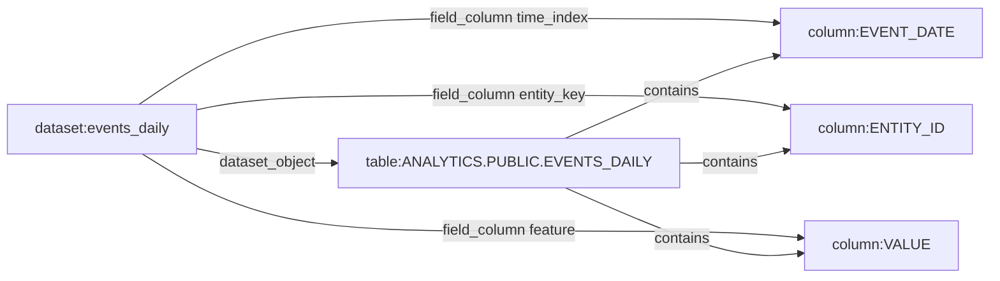

# Catalog Graph And Planner Design

Date: 2026-06-25

This document is the short design target for the future
`franken-snowflake-catalog` and `franken-snowflake-graph` crates. The beads that
implement catalog discovery, dataset planning, and lineage graph rendering are
blocked deeper in the DAG, so this file records the committable shape now and
keeps implementation work ready to start when they unblock.

## Scope

Two surfaces share the same catalog facts:

- `query plan` / `query run` use dataset manifests and column/operator catalogs
  to compile safe predicate pushdown SQL.
- `catalog graph` turns catalog snapshots into a typed lineage graph for JSON,
  Mermaid, and SVG output.

Both surfaces are read-only. They must work against deterministic fixtures before
live Snowflake credentials exist.

## Predicate-Pushdown Planner

The planner accepts either raw SQL mode or dataset mode. Raw SQL mode starts from
a caller-authored `SELECT` and runs safety checks. Dataset mode starts from a
dataset manifest plus a predicate AST.

Planning stages:

1. Resolve dataset identity.
   Load the dataset manifest, column catalog, and operator catalog for the
   requested dataset ID. Refuse unknown datasets with `did_you_mean` candidates.

2. Validate projection.
   Requested columns must resolve to manifest/catalog columns. Empty projection
   expands to a safe default from the manifest. Projection order is stable and
   preserved.

3. Validate filters.
   The filter AST is checked against the column and operator catalogs. Validation
   checks column existence, operator existence, arity, dtype class, null handling,
   and list-size limits before any SQL is emitted.

4. Compile pushed-down SQL.
   The planner quotes identifiers and pushes projection, entity filters, time
   filters, `known_at`/as-of constraints, and supported predicate operators into
   Snowflake SQL. It never pulls a large table locally to filter, aggregate, or
   profile.

5. Emit positional typed bindings.
   All values compile to Snowflake SQL API positional typed bindings. Values are
   never interpolated into SQL text. The compiled SQL contains placeholders only.

6. Apply guardrails.
   Every plan sets `STATEMENT_TIMEOUT_IN_SECONDS`, a result row cap, and
   `QUERY_TAG`. Large-result plans require an explicit limit, export mode, or
   confirmation token according to `docs/security_model.md`.

7. Fingerprint the plan.
   The plan ID is a deterministic hash over normalized SQL, binding metadata,
   profile fingerprint, dataset ID, selected time window, guardrails, and query
   tag fields. It is distinct from Snowflake's assigned `query_id`.

### Dataset Mode Shape

Input:

```json
{
  "dataset_id": "events_daily",
  "select": ["EVENT_DATE", "ENTITY_ID", "VALUE"],
  "entity": "ENTITY123",
  "from": "2024-01-01",
  "to": "2024-12-31",
  "as_of": "2024-12-31T23:59:59Z",
  "filter": {
    "and": [
      { "column": "VALUE", "op": "gt", "value": "0" }
    ]
  },
  "limit": 1000
}
```

Output:

```json
{
  "plan_id": "plan:fixture-events-daily-v1",
  "mode": "dataset",
  "sql": "SELECT \"EVENT_DATE\", \"ENTITY_ID\", \"VALUE\" FROM \"ANALYTICS\".\"PUBLIC\".\"EVENTS_DAILY\" AT(TIMESTAMP => ?) WHERE \"ENTITY_ID\" = ? AND \"EVENT_DATE\" >= ? AND \"EVENT_DATE\" <= ? AND \"VALUE\" > ? LIMIT ?",
  "bindings": {
    "1": { "type": "TIMESTAMP_NTZ", "value": "2024-12-31T23:59:59Z" },
    "2": { "type": "TEXT", "value": "ENTITY123" },
    "3": { "type": "DATE", "value": "2024-01-01" },
    "4": { "type": "DATE", "value": "2024-12-31" },
    "5": { "type": "FIXED", "value": "0" },
    "6": { "type": "FIXED", "value": "1000" }
  },
  "guardrails": {
    "statement_timeout_seconds": 60,
    "result_row_cap": 1000,
    "query_tag": "trace-fixture"
  }
}
```

The concrete placeholder syntax can change to match the SQL API schema bead, but
the invariant cannot: values live in typed positional bindings, not in SQL text.

### Refusals

Typed refusals are part of the planner contract:

| Code | Trigger |
|---|---|
| `FSNOW_DATASET_UNKNOWN` | Dataset ID is not known. |
| `FSNOW_COLUMN_UNKNOWN` | Projection or filter column is absent from the column catalog. |
| `FSNOW_OPERATOR_UNKNOWN` | Predicate operator is absent from the operator catalog. |
| `FSNOW_FILTER_OPERATOR_DTYPE` | Operator does not accept the column dtype class. |
| `FSNOW_FILTER_ARITY` | Operator value count does not match arity. |
| `FSNOW_RAW_SQL_UNSAFE` | Raw SQL is not a single safe `SELECT`. |
| `FSNOW_RESULT_TOO_LARGE` | Plan exceeds manifest row/export policy. |
| `FSNOW_AS_OF_UNSUPPORTED` | `--as-of` requested without a usable `known_at` or `time_index` axis. |

Refusals include safe next commands and `did_you_mean` where applicable.

## Lineage Graph Model

The graph crate consumes `CatalogSnapshot` data from
`docs/dataset_manifest_contract.md`. It models a typed directed multigraph:

| Node kind | Stable key |
|---|---|
| `profile` | `profile:<profile_id>` |
| `database` | `profile:<profile_id>/db:<database>` |
| `schema` | `profile:<profile_id>/db:<database>/schema:<schema>` |
| `object` | `profile:<profile_id>/db:<database>/schema:<schema>/object:<object>` |
| `column` | `profile:<profile_id>/db:<database>/schema:<schema>/object:<object>/column:<column>` |
| `stage` | `profile:<profile_id>/stage:<stage>` |
| `file_format` | `profile:<profile_id>/file_format:<format>` |
| `dataset` | `dataset:<dataset_id>` |

Required edge kinds:

| Edge kind | Direction |
|---|---|
| `contains` | profile -> database -> schema -> object -> column |
| `dataset_object` | dataset -> object |
| `field_column` | dataset -> column |
| `foreign_key` | referencing column -> referenced column |
| `view_depends_on` | view object -> source object |
| `lineage_reads` | derived object/dataset -> source object/dataset |
| `uses_stage` | object or export plan -> stage |
| `uses_file_format` | stage or export plan -> file format |

Every node and edge carries provenance: source artifact, snapshot ID, data source
class, and redaction markers.

## fnx-* Integration

The preferred implementation uses the FrankenNetworkX `fnx-*` crates:

- `fnx-classes` for graph data structures, if its API fits the typed node/edge
  model cleanly;
- `fnx-algorithms` for reachability, ancestors, descendants, connected
  components, and cycle detection;
- a small local adapter layer that maps franken_snowflake node and edge enums to
  fnx graph indices without exposing fnx internals in the public API.

If the fnx API is unstable or inadmissible under the forbidden-dependency scan,
the graph crate falls back to an in-house adjacency structure with the same
public query surface. The fallback must run the same fixture tests so the feature
does not disappear while dependency admissibility is being resolved.

Required query operations:

| Operation | Meaning |
|---|---|
| `ancestors(node)` | Upstream lineage and containers. |
| `descendants(node)` | Downstream objects, datasets, and fields. |
| `what_relates_to(node, depth)` | Bounded neighborhood for agent discovery. |
| `reachable(from, to)` | Boolean reachability for dependency checks. |
| `cycles()` | Dependency cycle report over lineage/dependency edges. |

## Mermaid And SVG Output

`catalog graph --mermaid` renders the typed graph to deterministic Mermaid text.
`catalog graph --svg` renders the same graph through FrankenMermaid once that
dependency is cargo-tree-proven.

Mermaid output rules:

- stable node ordering by node key;
- stable edge ordering by `(source, edge_kind, target)`;
- labels are redacted according to profile policy;
- graph size is bounded by explicit scope, depth, or object filter;
- empty-but-valid graphs return exit 0 with an empty graph payload;
- no secrets, profile hosts, tokens, or private downstream names are rendered.

Fixture example:



SVG output is a rendering of this Mermaid contract, not a separate graph model.
Golden tests compare Mermaid text byte-for-byte and smoke-test SVG generation
without requiring live Snowflake credentials.

## Implementation Milestones

When the blocked beads unblock, implement in this order:

1. Add `franken-snowflake-catalog` with pure data models for manifests, columns,
   operators, provenance, and predicate AST validation.
2. Add fixture-driven goldens for discovery output and operator JSON Schema.
3. Add the planner compiler with identifier quoting, positional typed bindings,
   guardrails, plan IDs, and typed refusals.
4. Add `franken-snowflake-graph` with the local public graph API and fnx adapter.
5. Add Mermaid golden output and SVG smoke tests.
6. Wire CLI/MCP handlers to the shared library models.

No live Snowflake account is required for the first implementation. Live catalog
scan proof comes later through the opt-in live proof lanes.
